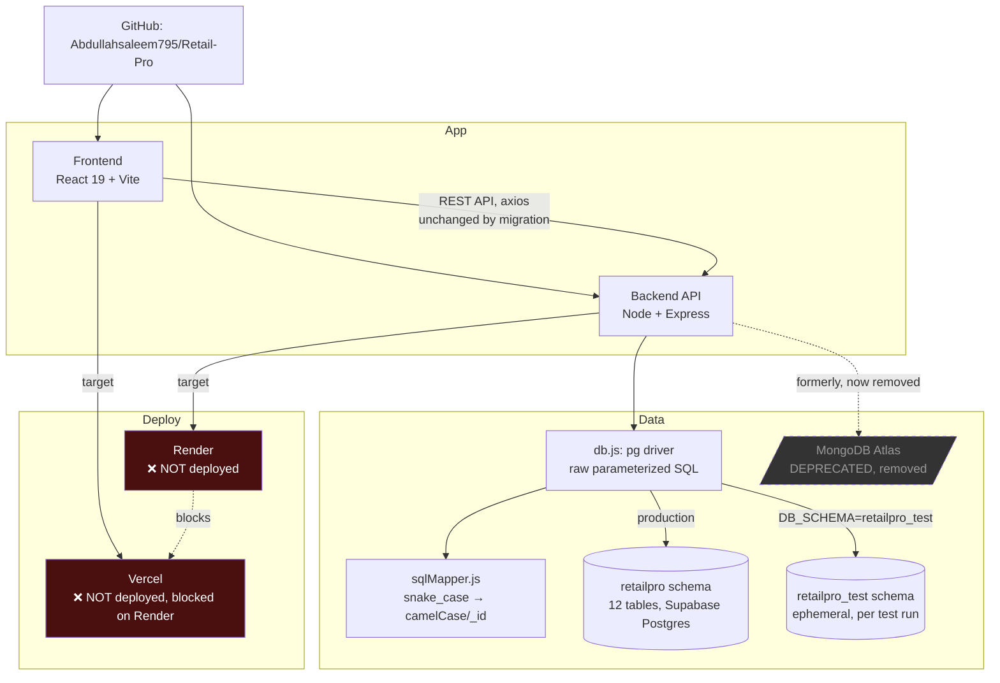
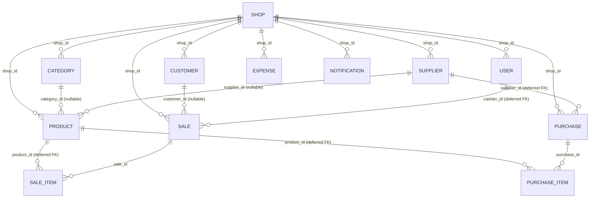

# RetailPro — Project Knowledge Graph

**Read this file (and `knowledge-graph.json`, the machine-readable source of truth) before re-deriving
project context from conversation history.** Update both whenever something changes — a decision, a
deployment status flip, a bug fix, a new module. Don't let this go stale; a wrong graph is worse than
no graph.

_Last updated: 2026-07-28 — after ruling out `deploy_to_vercel` (direct-upload MCP tool) for this
project's size; Vercel deployment goes through the dashboard Git-import flow instead._

---

## System map



## Data model



Every table is `shop_id`-scoped for multi-tenancy. **Deferred FKs** (`purchase_items.product_id`,
`sale_items.product_id`, `purchases.supplier_id`, `sales.cashier_id`) exist because a full shop
cascade-delete hits two independent FK paths with no ordering guarantee between them — see the
Decision Log below.

---

## Current status (read this first)

| Area | Status |
|---|---|
| Backend (Express + Postgres) | ✅ Complete, migrated, tested, pushed |
| Frontend (React/Vite) | ✅ Complete — **zero changes** needed for the DB migration |
| Database | ✅ Live on Supabase (`retailpro` schema, project `tslqkswcrbihlavccjek`) |
| Tests | ✅ 48/48 passing, against a real isolated Postgres schema |
| GitHub | ✅ Pushed, `main` @ `38680c3` |
| **Render (backend deploy)** | ❌ **Not done** — user must complete manually, no Render API access |
| **Vercel (frontend deploy)** | ❌ **Not done** — blocked on Render being live (needs the API URL) |

---

## Key facts an agent should know before touching this project

- **This Supabase project hosts another, unrelated app** in the `public` schema (its own `users`,
  `players`, `settings` tables). RetailPro lives entirely in a separate `retailpro` schema. Never
  write to `public.*` here.
- **Use the Supabase pooler host**, never `db.<ref>.supabase.co` directly — that host is IPv6-only and
  most environments have no outbound IPv6, so it just times out.
- **`backend/src/db/schema.sql`** is the canonical DDL, templated with `{{SCHEMA}}`. Both the live
  `retailpro` schema and the ephemeral `retailpro_test` test schema are built from this one file —
  don't hand-edit either schema directly; edit this file and re-apply.
- **Numeric columns need the type-parser fix** in `config/db.js` (OID 1700 → float) or every
  price/quantity field silently becomes a string in JSON responses.
- **`sqlMapper.js`'s regex excludes position 0** so a literal `'_id'` key built inside
  `jsonb_build_object()` (for populated/joined objects) isn't mangled into `'Id'`.
- **The frontend was never touched** during the Postgres migration — same REST contract, same
  `_id`/camelCase field shapes, same populated nested objects.
- **Demo login:** `demo@retailpro.pk` / `demo1234` (owner), `cashier@retailpro.pk` / `demo1234`.
- **Secrets** live in `backend/.env` (gitignored, never commit). Contains `DATABASE_URL`, JWT secrets,
  optional WhatsApp Cloud API keys. The Supabase DB password was pasted in chat during setup — worth
  rotating before this holds real shop data.

---

## Decision log

Chronological, most-recent-relevant first. Full detail in `knowledge-graph.json` → `decisionLog`.

1. **Migrated MongoDB → Supabase Postgres** on explicit instruction ("shift backend A to Z to
   supabase"). Scoped deliberately: kept Express, JWT auth, and the permission system unchanged —
   only the data layer moved.
2. **Raw `pg` driver, not Supabase's JS client or an ORM.** The JS client goes through PostgREST,
   which only exposes `public` by default (a Dashboard setting with no API access to change it). Raw
   `pg` sidesteps that and keeps transaction logic in JS, close to the original Mongoose pattern.
3. **Dedicated `retailpro` schema, not `public`** — collision risk with the pre-existing unrelated app.
4. **Pooler host required** — direct host is IPv6-only.
5. **Deferred FK constraints** on four columns — a full shop cascade-delete races two independent FK
   paths with no ordering guarantee; deferring the check to commit time fixes it without weakening
   protection on an ordinary standalone delete.
6. **Global NUMERIC type parser** — `pg` returns `NUMERIC` as strings by default; the frontend does
   real arithmetic on these fields.
7. **Tests run against a real, isolated Postgres schema**, not mocks — same principle as the earlier
   `mongodb-memory-server` choice, just ported to Postgres.
8. **Vercel is blocked on Render** — deploying the frontend alone would just produce a URL with no
   working backend behind it.
9. **Ruled out the `deploy_to_vercel` MCP tool** (direct file upload, no git) for this project — it
   requires every source file embedded literally in the tool call. A test assembly of the frontend's
   payload (62 files, ~200KB even after excluding `package-lock.json`) hit ~113K tokens and got
   truncated just being read back — clearly impractical, and the tool's own description says it's for
   a small just-generated app, not an existing multi-file repo. **Use Vercel's dashboard "Import Git
   Repository" flow instead** — also better long-term since it auto-deploys on every future push,
   same as Render.

---

## Bugs found and fixed (this migration)

All four were caught by *running* the code, not by reading it — a reminder to keep verifying live,
not just trusting a green test suite.

| Bug | Found via | Fix |
|---|---|---|
| Cascade-delete ordering violation | Seed script's re-run cleanup failing with a real FK error | `DEFERRABLE INITIALLY DEFERRED` on 4 FKs |
| `search_path` race on connect | A genuine "client already executing a query" warning during seeding | Set via `pg` startup `options`, not a fire-and-forget query |
| Numeric columns returned as strings | 12 failing tests | Global type parser for OID 1700 |
| Nested `_id` → `Id` mangling | **No test caught this** — found by manually inspecting a live API response, confirmed in the rendered browser | Regex excludes position 0 in `sqlMapper.js` |

---

## Where things are

```
backend/
├── server.js                    Entry point
├── src/
│   ├── app.js                   Express app, middleware, routes
│   ├── config/db.js              pg.Pool, query()/withTransaction(), numeric type parser
│   ├── config/permissions.js     Role defaults + grantable permission list
│   ├── db/schema.sql              ⭐ canonical DDL — source of truth for BOTH schemas
│   ├── controllers/               11 files, one per resource, raw parameterized SQL
│   ├── utils/sqlMapper.js         snake_case → camelCase/_id
│   └── utils/seed.js              Demo data (18 products, 30 days of sales)
└── tests/
    ├── globalSetup.js             Creates retailpro_test from schema.sql (once per run)
    ├── setup.js                   Truncates all tables between tests
    └── globalTeardown.js          Drops retailpro_test (once per run)

frontend/
└── src/                          Untouched by the DB migration — see README for structure

docs/
├── knowledge-graph.json          ⭐ THIS — machine-readable source of truth
├── knowledge-graph.md            ⭐ THIS — human-readable view (you're reading it)
└── design-brief.md               Material 3 design brief, all 17 screens
```

---

## Open items

- [ ] Deploy backend to Render (`backend/render.yaml` ready; user must do the dashboard steps —
      `DATABASE_URL`, `JWT_ACCESS_SECRET`, `JWT_REFRESH_SECRET`, `CLIENT_URL`)
- [ ] Deploy frontend to Vercel (blocked on the above — needs the Render URL for `VITE_API_URL`)
- [ ] Rotate the Supabase DB password before this holds real shop data (it was shared in chat)
- [ ] Camera barcode scanning built but never verified against a real camera (sandbox has none)
- [ ] WhatsApp Cloud API delivery never tested with real credentials (only the no-op/logging path)
