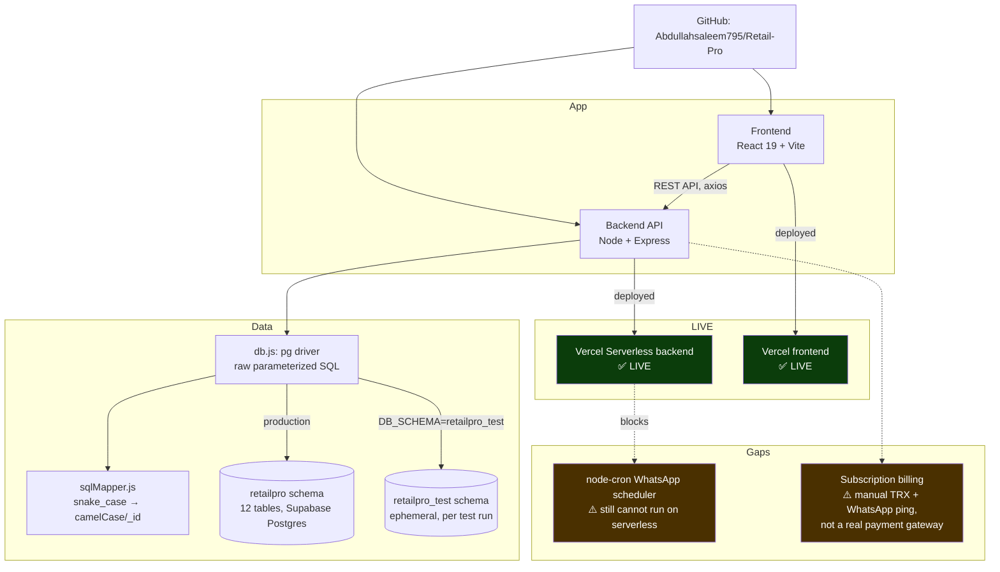
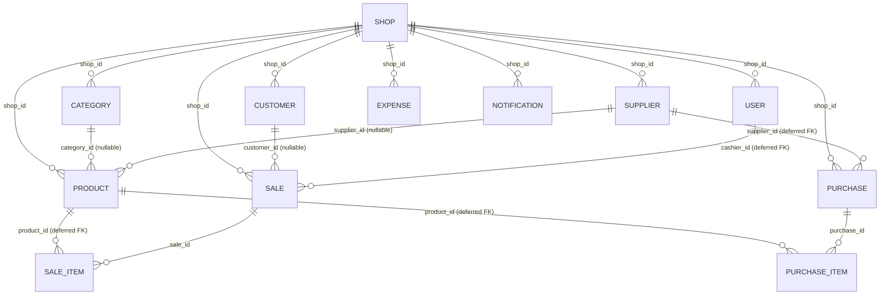

# RetailPro — Project Knowledge Graph

**Read this file (and `knowledge-graph.json`, the machine-readable source of truth) before re-deriving
project context from conversation history.** Update both whenever something changes — a decision, a
deployment status flip, a bug fix, a new module. Don't let this go stale; a wrong graph is worse than
no graph.

_Last updated: 2026-08-08 — feature + polish pass on top of the 2026-08-05 pass. Added Expiry Date
Alerts (owner-configured per-product threshold, only surfaces once actually triggered) and Bulk
Product CSV Import (upsert-by-SKU, per-row validation, auto-category-create+dedup, tested twice —
direct API and real browser file upload). Fixed a chain of POS cart bugs surfaced via user
screenshots — undersized touch targets, two distinct alignment bugs (glyph-centering, then per-row
`auto` grid columns), a scroll-to-top regression, and a name-truncation-plus-scrollbar-overlap bug —
each root-caused individually rather than patched cosmetically. Converted Payment Method to a native
dropdown, changed the sidebar to grey, and fixed the one real bug found in a full responsive audit
(topbar overflow at mobile widths). A "Target and Suggestion" profit-goal feature was scoped and
explicitly deferred by the user, not built. See the new dated section below for detail. All UI fixes
verified live with real DOM measurements (`getComputedStyle`, `getBoundingClientRect`, `scrollY`),
not just visual screenshot judgment, and all test data was cleaned up after verification._

---

## System map



## Data model



Every table is `shop_id`-scoped for multi-tenancy. `shops` also now carries subscription columns
(`subscription_plan`, `subscription_status`, `subscription_ends_at`, `last_payment_trx`) added by the
billing feature.

---

## Current status (read this first)

| Area | Status |
|---|---|
| Backend (Express + Postgres) | ✅ Complete, tested, deployed |
| Frontend (React/Vite) | ✅ Complete |
| Database | ✅ Live on Supabase (`retailpro` schema, project `tslqkswcrbihlavccjek`) |
| Tests | ✅ Documented as 48/48 passing (not re-run in this audit — no verified local DB credentials in this session) |
| **Vercel backend** | ✅ **LIVE** — verified `https://retail-pro-backend.vercel.app/api` responds `{success:true}` |
| **Vercel frontend** | ✅ **LIVE** — verified `https://retail-pro-blush.vercel.app` serves the SPA |
| Core POS/Inventory/Sales/Purchases/Customers/Expenses/Reports/Staff | ✅ Built, per README + code inspection |
| Offline POS (IndexedDB queue) | ✅ Built |
| Bilingual (English/Urdu RTL) | ✅ Built |
| PWA | ✅ Built |
| Performance pass (indexes, prefetch, skeleton loaders, compression) | ✅ Done, 5 commits, figures self-reported not re-benchmarked |
| QA pass (auth/POS/inventory/UI edge cases) | ✅ 100/100 self-reported in `QA_REPORT.md` |
| Subscription billing UI + backend | ✅ Built, request flow's 500 bug fixed, activation now admin-gated — still **manual** payment (no live gateway) |
| Platform admin console (`/admin`) | ✅ **New 2026-08-03** — cross-tenant subscription activation, `PLATFORM_ADMIN_KEY`-gated |
| WhatsApp Cloud API automated cron reports | ✅ **Fixed 2026-08-03** — `/api/cron/*` + Vercel Cron Jobs; needs `CRON_SECRET` set on Vercel to go live |
| WhatsApp wa.me manual deep-links (suppliers, low-stock, billing proof) | ✅ Built, still available as the manual path |
| Thermal ESC/POS receipt printing | ✅ **New 2026-08-03** — Web Bluetooth, Chrome/Edge only, **not yet tested on real hardware** |
| Real JazzCash/EasyPaisa merchant API | ❌ Not built — scaffold added 2026-08-03, needs real merchant credentials to activate |
| Multi-branch stock transfers | ✅ **New 2026-08-03** — manifest/logistics tracking, not live per-branch inventory splitting |
| WhatsApp phone number handling (Cloud API + wa.me) | ✅ **Fixed 2026-08-05** — was silently broken for every real (local-format) phone number, see dated section below |
| Subscription payment accounts (JazzCash/EasyPaisa/bank) | ✅ **New 2026-08-05** — admin-editable via `/admin`, was hardcoded before |
| Notification bell mark-as-read | ✅ **Fixed 2026-08-05** — opening the panel now actually clears the badge |
| Notification delete | ✅ **New 2026-08-05** — per-item delete, previously read-only-forever |
| Customer delete permission gating | ✅ **Fixed 2026-08-05** — was completely unguarded, any cashier could delete a customer |
| Camera barcode scanning | ⚠️ **Rebuilt 2026-08-05 on `@zxing/browser`/`@zxing/library`** — decode pipeline proven correct via offline test; StrictMode double-instance race and an upstream ZXing `TRY_HARDER` bug both found and fixed; **a live successful scan of a physical barcode was not yet confirmed by the user** |
| PIN quick-switch login | ✅ Built (predates this doc pass) — `POST /api/auth/pin-login`, 4-6 digit PIN, 5-attempt lockout (15 min), separate from password auth, see `authController.js` |

---

## ✅ The two gaps flagged in the 2026-08-02 audit are now fixed

1. **WhatsApp automation on serverless — FIXED.** `backend/src/routes/cronRoutes.js` exposes
   `GET /api/cron/{low-stock,daily-report,weekly-report}`, secret-gated via `CRON_SECRET` (fails closed
   if unset). `backend/vercel.json` now has a `crons` array hitting them on the same schedule the old
   `node-cron` used (03:00/16:00/16:00-Sun UTC = 08:00/21:00/21:00-Sun PKT). This is the real fix — the
   `wa.me` deep-links from `feature_whatsapp_wame` still exist as a manual/on-demand path, but the
   *automated* reports now actually have somewhere to run. **Action needed**: `CRON_SECRET` must be set
   as a Vercel project env var (same value as `backend/.env`) for Vercel's own Cron Jobs to authenticate —
   implemented and locally verified, not yet confirmed configured on the live Vercel project.
2. **Subscription self-activation — FIXED.** The old `POST /api/shop/subscription/activate`
   (self-service, gated only by the caller's own `shop:settings` permission) is **removed**. Activation
   now lives at `POST /api/admin/shops/:shopId/subscription/activate`, gated by a `PLATFORM_ADMIN_KEY`
   header only the platform operator holds (`backend/src/middleware/platformAdmin.js`, fails closed if
   unset). A new `/admin` console page lets the operator review pending upgrade requests across all shops
   and activate or reject them. Verified end-to-end via a real browser walkthrough: request in Settings →
   appears in `/admin` → Activate → shop flips to active, drops out of the pending list.

**Bonus find while fixing #2**: the live Supabase `notifications_type_check` constraint didn't allow
`type='subscription'`, so `requestSubscriptionUpgrade` was **500ing on every real call** — the feature
had never actually worked in production. Also, `shops_subscription_plan_check` only allowed
`free/pro/enterprise` while the Settings UI offers a `basic` tier. Both fixed via a live migration,
mirrored into `schema.sql` (which had drifted from the live DB — see Decision log).

---

## 2026-08-05 pass: bug fixes + camera barcode scanner rebuild

1. **Fixed: every WhatsApp touchpoint was silently broken for real phone numbers.** Every phone
   number in the live database (`shops.whatsapp_number`, `suppliers.phone`, `customers.phone`) was
   stored in local Pakistani format (`03001234567`), but both `wa.me` links and the WhatsApp Cloud
   API require full international format with no leading trunk zero (`923001234567`). Passing the
   local form straight through made `wa.me` show "phone number shared via url is invalid" and would
   make a real Cloud API send fail outright. Fixed with a shared `normalizePakistaniPhone()` in
   `backend/src/services/whatsappService.js`, applied inside both `sendTextMessage()` and
   `buildWhatsAppUrl()`; also removed a second, unnormalized, duplicated phone-cleaning
   implementation that had drifted into `shopController.js`'s `requestSubscriptionUpgrade`. Verified
   live: Suppliers page's "💬 Order" button now generates a correct `wa.me/923001234567` link (was
   `wa.me/03001234567` before), and all three cron endpoints re-tested clean against a shop with
   fully local-format numbers.
2. **New: admin-editable subscription payment accounts.** JazzCash/EasyPaisa/bank account details
   shown to shop owners on the Settings billing card used to be hardcoded in the frontend. Added a
   `platform_payment_accounts` singleton table (`id integer PRIMARY KEY DEFAULT 1 CHECK (id=1)`),
   `GET/PUT /api/admin/payment-accounts` (admin-key gated) and `GET /api/shop/payment-accounts`
   (any signed-in shop user), and a new card in `/admin` (`AdminConsole.jsx`) to edit them. Verified
   end-to-end: admin edits a field → live DB updates → shop-facing Settings page reflects the change
   immediately; a plain shop JWT gets 401 on the write endpoint.
3. **Redesigned Settings.jsx's Subscription & Billing card.** The previous version was emoji-heavy
   and used an off-brand blue for the language toggle, inconsistent with the app's green brand and
   the rest of the design system. Rebuilt with `Settings.css` + design tokens instead of ~250 lines
   of inline styles. Also fixed a form-row label-alignment bug (a 2-line label pushed its input out
   of alignment with same-row siblings) with a global `.form-row .form-field label` rule in
   `frontend/src/index.css`.
4. **Fixed: notification bell never actually cleared the unread badge.** Opening the bell dropdown
   re-fetched notifications but never marked anything read — only clicking an individual item did,
   so the badge count stayed stuck even after the owner had visibly seen the list. Fixed so opening
   the panel now calls `markAllNotificationsRead()` automatically, matching standard notification-UX
   convention (`frontend/src/components/NotificationBell.jsx`).
5. **New: per-notification delete.** Notifications previously could only be marked read, never
   removed, so old test/low-stock alerts accumulated forever with no cleanup path for the shop
   owner. Added `DELETE /api/notifications/:id` (open to any signed-in shop user, same trust level
   as mark-as-read) and a delete control on each row in the bell dropdown.
6. **Fixed: customer delete had zero permission gating.** Every other entity's delete route
   (products, categories, suppliers, expenses) requires a `*_MANAGE` permission; `customerRoutes.js`
   had no `requirePermission` call at all on create/update/delete — any authenticated cashier could
   delete a customer record. Found while auditing delete capabilities across entities for an
   unrelated question about owner permissions. Added `PERMISSIONS.CUSTOMER_MANAGE`
   (`backend/src/config/permissions.js`), granted to `manager` role by default (owner already has
   all permissions), gated on the customer routes. Verified live: a cashier account now gets `403`
   on `DELETE /api/customers/:id`, owner still succeeds.
7. **Camera barcode scanner: rebuilt twice, two real library-level bugs found and fixed.** See
   `feature_barcode` in `knowledge-graph.json` for full detail. Summary:
   - Original bug reported ("camera opens but doesn't scan") traced to **React 18 StrictMode's
     dev-mode double-effect-invoke** creating two concurrent camera instances that both wrote into
     the same DOM target — first with `html5-qrcode` (two `<video>` elements layered on top of each
     other, visibly a doubled/frozen feed), fixed by clearing stale DOM nodes and chaining cleanup
     onto the in-flight start promise instead of racing it.
   - Also fixed: the scan-region box was a small fixed `300×200px` patch, centered — anything outside
     it (e.g. a barcode in the corner of frame, as shown in a user screenshot) was never even looked
     at by the decoder. Made it size dynamically to ~90% of the actual video frame.
   - User then explicitly asked to switch decode engines to ZXing. Swapped `html5-qrcode` for
     `@zxing/browser` + `@zxing/library` (the actively-maintained JS/TS port — `html5-qrcode` was
     already using a bundled/vendored copy of zxing-js internally with no direct control over it).
     Restricted `POSSIBLE_FORMATS` to retail 1D formats only (EAN-13/8, UPC-A/E, Code128/39, ITF,
     Codabar) and moved the camera to a proper React ref instead of a DOM-id string.
   - **Found the exact same StrictMode race again, in a different shape**: ZXing's `controls.stop()`
     unconditionally clears the shared `<video>` element's `srcObject` (`cleanVideoSource`), not
     scoped to "its own" stream — so the two StrictMode phantom instances again fought over the same
     video element, and whichever's delayed stop-cleanup fired last wiped out the other's
     already-working feed. Fixed with a `teardownChainRef` that serializes start/stop across effect
     invocations, so the second instance always waits for the first to fully release the camera
     before touching the shared ref.
   - **Found a genuine bug in `@zxing/browser@0.2.1` itself** (latest published version, not an old
     one): `HTMLCanvasElementLuminanceSource.tempCanvasElement` is compared against `null` in its
     lazy-init check, but the field is actually left `undefined` (never initialized), so the check
     never passes and `rotate()` throws `"Could not create a Canvas element."` on every single frame
     whenever `DecodeHintType.TRY_HARDER` is enabled. `TRY_HARDER` is precisely the hint meant to help
     with imperfect real-world images (the fixed-focus-webcam problem this whole investigation started
     from) — traded that capability away deliberately rather than ship a crash-looping decode path.
   - **Proved the decode pipeline itself is correct** via an offline test with zero camera/network
     dependency: hand-built a bit-perfect, checksum-valid EAN-13 barcode image in Node (no image
     library available to auto-generate 1D barcodes, so built the bar pattern directly from the
     EAN-13 spec) and fed it through the exact `MultiFormatReader` config the app uses — decoded
     correctly. This isolates any remaining real-world scan failures to camera capture conditions
     (focus/lighting/distance/motion), not the code.
   - Added a synthesized beep (`frontend/src/utils/beep.js`, Web Audio API, no audio asset) on
     successful add-to-cart, for both the camera-scan and hardware-scanner/manual-entry paths.
   - **Status as of this write-up: the offline decode logic is proven correct; a live successful
     real-world camera scan of a physical barcode was not yet confirmed working by the user** — the
     conversation moved on to a hardware-scanner feature request before that final confirmation
     happened. Flagged in Open items below.
8. **New: hardware "wedge" barcode scanner support in POS, with an honest limitation documented.**
   User asked for a "connect to Barcode Scanner" detection when clicking Scan. Established that
   USB/Bluetooth keyboard-emulation scanners (confirmed via a photo of the user's actual hardware —
   a handheld laser gun and a Honeywell Orbit-style dome scanner, both standard keyboard-wedge
   devices in their default mode) are **not detectable by any web API** — to the browser they're
   indistinguishable from a keyboard. No "is it connected" check was built, since a fake one would be
   dishonest. Built the real functional equivalent instead: `POS.jsx`'s search input now
   automatically regains focus after every action that could otherwise steal it (adding a product by
   clicking a card, closing the camera scanner, completing a sale), so a wedge scanner "just works"
   continuously with zero clicks needed, plus a plain-language hint under the search bar explaining
   both paths (scan directly vs. tap Scan for the camera).

---

## 2026-08-08 pass: expiry alerts, bulk import, POS UI polish

1. **New: Expiry Date Alerts.** Added `products.expiry_date` and `products.expiry_alert_days`
   (`schema.sql` + live Supabase). `ProductFormModal.jsx` gained Expiry Date + "alert N days before"
   fields (days field disabled until a date is set). New `GET /api/products/expiry-alerts` only
   returns a product once it's actually within its own configured window
   (`expiry_date - CURRENT_DATE <= expiry_alert_days`), including already-expired ones — a product
   with a date but no threshold, or no date at all, never shows up here. New `ExpiryAlerts.jsx` page
   groups triggered alerts into "N-Day Alert" sections with red "expired" / yellow "N days left"
   badges. Verified live for triggered, not-yet-triggered, and already-expired cases.
2. **New: Bulk Product CSV Import.** User asked "suggest what to add to make everything easier for
   the owner?" — offered 5 ideas, picked this one ("bulk product import, go for it and keep
   everything disciplined"). `POST /api/products/bulk-import` upserts by `(shop_id, sku)` — re-
   importing the same file to bulk-update prices/stock is a supported use case, not just one-time
   onboarding. Each row validated independently (name/sku required, prices ≥ 0, unit must be valid,
   `expiryAlertDays` requires an `expiryDate` on the same row); one bad row doesn't fail the batch —
   results come back as `{created, updated, failed}` plus a per-row error table with the actual CSV
   line number. New categories are auto-created and deduped via an in-request cache so 500 rows
   sharing one new category name don't create 500 categories. `BulkImportModal.jsx` offers a
   downloadable CSV template, client-side parsing (PapaParse), a friendly-header mapping ("Cost
   Price" → `costPrice`), a pre-import row-count preview, and a post-import summary/error table.
   Tested twice per explicit follow-up request ("test the bulk import on the browser"): once via
   direct API calls, once with real browser clicks and a real file upload — confirmed an actual DB
   row changed, then reverted it and deleted the test-created product. Full Jest suite (48/48)
   re-run clean both times.
3. **Fixed: a chain of POS cart bugs, each reported via a user screenshot, each with a distinct root
   cause** (see `pos_cart_polish_pass` in `knowledge-graph.json` for full detail):
   - "Remove doesn't work" → the handler was always correct; the tap target was 22×19px, well under
     the ~44px touch-target guideline this phone-first POS needs. Enlarged remove/qty buttons to
     32×32px.
   - "+/- not aligned" → `.pos-qty-control button` was missing the explicit flex-centering
     `.pos-remove-btn` already had.
   - Clicking a product scrolled the page back to the top every time → an earlier-session
     `refocusSearch()` call (for wedge-scanner support) used plain `.focus()`, which auto-scrolls an
     off-screen element into view by default. Fixed with `focus({ preventScroll: true })`.
   - "+/- still not aligned" (a **second**, different bug) → each cart row is its own independent CSS
     grid, so `auto`-sized columns computed different widths per row based on that row's own price
     text, shifting qty/total/remove out of alignment row-to-row. Fixed with fixed pixel grid columns
     instead of `auto`.
   - Severely truncated names ("Shan Birya...") plus a stray icon next to remove → only reproduced at
     the exact width (1000px) where the desktop 2-column layout locks the cart panel to a fixed
     380px (name column was down to 99.2px, confirmed via `getComputedStyle`). Fixed with a 2-line
     text clamp instead of single-line ellipsis, trimmed grid columns further, and added
     `padding-right` to the scrollable cart list — the "stray icon" was the browser's own scrollbar
     arrow-chrome rendering with no reserved space, directly on top of the remove button once the
     cart had enough items to scroll.
   - Every fix verified live at the specific viewport/cart-size that reproduces it, with real
     `getComputedStyle`/`getBoundingClientRect`/`scrollY` measurements, not just visual judgment.
4. **Changed: Payment Method from an always-visible chip row to a native `<select>`** defaulting to
   Cash, matching the existing Customer `<select>` pattern, per direct user request.
5. **Changed: sidebar color from dark navy (`#101828`) to grey (`#4b5563`)**, with nav-link text/hover
   colors adjusted for contrast (active state kept the brand green).
6. **Responsive audit**: checked the whole app at mobile/tablet widths; found one real bug —
   `.dash-topbar` had zero responsive handling and silently overflowed (clipping the logout button)
   at ≤768px even though the sidebar itself already collapsed correctly. Fixed with breakpoint rules
   hiding/truncating topbar content progressively at 768px and 480px. Confirmed no scroll overflow
   after, and no RTL/Urdu regression.
7. **Deferred, not built: "Target and Suggestion" monthly profit-goal feature.** User described a
   flow where the owner sets a monthly profit target and the app compares it to actual profit,
   flags best/worst sellers, and suggests a "strategy" — but asked to hear the implementation plan
   first ("fist tell me how will you do it?"). After the plan was explained and a clarifying
   question was asked (rule-based math suggestions vs. real AI-generated strategy text), the user
   said "leave it fo now" without answering — treated as a full defer, not a partial one. Nothing
   was scaffolded; don't resume building this from a stale summary without re-confirming scope.

---

## Key facts an agent should know before touching this project

- **This Supabase project hosts another, unrelated app** in the `public` schema. RetailPro lives entirely
  in a separate `retailpro` schema. Never write to `public.*` here.
- **Use the Supabase pooler host**, never `db.<ref>.supabase.co` directly — IPv6-only, times out on most
  networks.
- **`backend/src/db/schema.sql`** is the canonical DDL, templated with `{{SCHEMA}}`. Don't hand-edit either
  the live or test schema directly.
- **Numeric columns need the type-parser fix** in `config/db.js` (OID 1700 → float).
- **`sqlMapper.js`'s regex excludes position 0** so a literal `'_id'` key inside `jsonb_build_object()`
  isn't mangled into `'Id'`.
- **Demo login:** `demo@retailpro.pk` / `demo1234` (owner), `cashier@retailpro.pk` / `demo1234`.
- **Secrets** live in `backend/.env` (gitignored). Supabase DB password was pasted in chat during original
  setup — still worth rotating before this holds real shop data.
- **Subscription activation is admin-gated, NOT self-service** (fixed 2026-08-03, see gap #2 above)
  — this note used to say the opposite; corrected 2026-08-05. Don't describe it as insecure without
  re-checking `platformAdmin.js` first.
- **WhatsApp Cloud API automated reports run via Vercel Cron Jobs** (fixed 2026-08-03, see gap #1
  above) — this note used to say they were dead in production; corrected 2026-08-05. Still requires
  `CRON_SECRET` to be set as a Vercel env var to actually fire on the live deployment (see Open items).
- **Every phone number in the app is stored/entered in LOCAL Pakistani format** (`03001234567`, what a
  shopkeeper actually types), but `wa.me` links and the WhatsApp Cloud API both require full
  international format (`923001234567`, no leading 0, no `+`). Always go through
  `normalizePakistaniPhone()` in `whatsappService.js` — never build a WhatsApp URL or API call from a
  raw phone column. This exact bug silently broke every WhatsApp touchpoint in production until fixed
  2026-08-05.
- **React 18 StrictMode + any imperative camera/video library is a known trap.** Dev-mode double-invokes
  every effect (mount → cleanup → mount), and camera-decoding libraries (`html5-qrcode`, `@zxing/browser`)
  manipulate the DOM/video element directly rather than through React state. If cleanup checks a
  synchronous "is it running" flag before an async `start()` has resolved, or if `.stop()` from a stale
  instance runs after a newer instance already attached its stream, you get two competing camera feeds
  or a wiped-out working one. See `feature_barcode`/`BarcodeScanner.jsx`'s `teardownChainRef` pattern
  before touching this component again.
- **`@zxing/browser@0.2.1`'s `DecodeHintType.TRY_HARDER` is broken** — throws
  `"Could not create a Canvas element."` on every frame due to an uninitialized field
  (`tempCanvasElement` checked against `null` but left `undefined`). Don't re-enable it without
  checking if a newer release has fixed it first.
- **Customer delete/create/update had zero permission gating until 2026-08-05** — if you're auditing
  permission coverage across entities again, check `customerRoutes.js` first; it's the one that
  historically drifted from the `requirePermission(PERMISSIONS.*_MANAGE)` pattern every sibling route uses.

---

## Decision log

Chronological, most-recent-relevant first. Full detail in `knowledge-graph.json` → `decisionLog`.

1. **Verified both Vercel deployments live via direct HTTP check** (2026-08-02) — the graph had drifted
   out of sync with reality; PROJECT_PROGRESS.md/README already claimed live URLs, confirmed directly
   rather than trusting docs at face value.
2. **wa.me deep-links added instead of fixing the cron/serverless conflict** (commit `67db8e7`) — cheapest
   path to a working WhatsApp feature given Vercel serverless can't run `node-cron`; trades automation for
   a manual click. Underlying scheduler problem still open.
3. **Subscription billing built as manual record-and-WhatsApp-ping, not a gateway integration** (commit
   `14629cf`) — no JazzCash/EasyPaisa merchant credentials exist. Functional gap: `activateSubscription`
   has no visible admin-only guard.
4. **Migrated MongoDB → Supabase Postgres** on explicit instruction — kept Express/JWT/permissions
   unchanged, only the data layer moved.
5. **Raw `pg` driver, not Supabase's JS client or an ORM** — the JS client goes through PostgREST, which
   only exposes `public` by default.
6. **Dedicated `retailpro` schema, not `public`** — collision risk with the pre-existing unrelated app.
7. **Pooler host required** — direct host is IPv6-only.
8. **Deferred FK constraints** on four columns — a full shop cascade-delete races two independent FK paths.
9. **Global NUMERIC type parser** — `pg` returns `NUMERIC` as strings by default.
10. **Tests run against a real, isolated Postgres schema**, not mocks.
11. **User pivoted the backend deployment target to Vercel Serverless** (commit `e837f35`) — now live,
    but the cron consequence (#2 above) was never resolved, only worked around.
12. **User replaced native `window.confirm()` with `ConfirmModal`** (commit `ce57f35`) across every
    dashboard delete/remove action.

---

## Bugs found and fixed (Mongo→Postgres migration)

| Bug | Found via | Fix |
|---|---|---|
| Cascade-delete ordering violation | Seed script re-run cleanup failing with a real FK error | `DEFERRABLE INITIALLY DEFERRED` on 4 FKs |
| `search_path` race on connect | Genuine "client already executing a query" warning | Set via `pg` startup `options` |
| Numeric columns returned as strings | 12 failing tests | Global type parser for OID 1700 |
| Nested `_id` → `Id` mangling | Found by manual inspection, no test caught it | Regex excludes position 0 in `sqlMapper.js` |

---

## Where things are

```
backend/
├── server.js                    Entry point (long-running; NOT what Vercel runs)
├── api/index.js                  ⭐ Vercel Serverless entry point — exports `app`, no app.listen(),
│                                    never calls connectDB()/startScheduler() (see gap #1)
├── vercel.json                   Rewrites /api/* -> /api/index.js — LIVE at retail-pro-backend.vercel.app
├── render.yaml                   Superseded, unused
├── src/
│   ├── app.js                   Express app, middleware, routes
│   ├── config/db.js              pg.Pool, query()/withTransaction(), numeric type parser
│   ├── config/permissions.js     Role defaults + grantable permission list
│   ├── db/schema.sql              ⭐ canonical DDL — source of truth for BOTH schemas + composite indexes
│   ├── controllers/               11 files incl. shopController.js (subscription billing)
│   ├── services/whatsappService.js  Cloud API (cron, non-functional on serverless) + wa.me link builder
│   ├── utils/sqlMapper.js         snake_case → camelCase/_id
│   └── utils/seed.js              Demo data
└── tests/                        48 Jest+supertest tests (auth, tenancy, permissions, sales)

frontend/
├── src/pages/dashboard/Settings.jsx   Subscription plan picker + upgrade request UI
├── src/pages/dashboard/Suppliers.jsx  wa.me reorder deep-links
├── src/layouts/DashboardLayout.jsx    Idle + hover link prefetching for instant nav
├── src/components/ConfirmModal.jsx    Replaces window.confirm() everywhere
└── src/components/SkeletonLoader*     Perf-pass loading states
                                   LIVE at retail-pro-blush.vercel.app

docs/
├── knowledge-graph.json          ⭐ machine-readable source of truth
├── knowledge-graph.md            ⭐ this file
└── design-brief.md               Material 3 design brief, all 17 screens

PROJECT_OVERVIEW.md               Business/pitch doc + SaaS monetization models
PROJECT_PROGRESS.md               Self-reported ~97% completion status (updated 2026-08-03)
QA_REPORT.md                      Self-reported 100/100 QA pass
```

### New in the 2026-08-03 hardening pass (not yet reflected in the tree above)

```
backend/src/
├── middleware/platformAdmin.js        requirePlatformAdmin - x-admin-key gate, fails closed
├── controllers/adminController.js     Cross-tenant: list shops, activate/reject subscriptions
├── controllers/branchController.js    Branches + stock transfer manifests
├── routes/adminRoutes.js              /api/admin/*
├── routes/branchRoutes.js             /api/branches/*
├── routes/cronRoutes.js               /api/cron/* - CRON_SECRET-gated, called by Vercel Cron Jobs
└── services/paymentProviders/         index.js, manualProvider.js, jazzcashProvider.js (stub),
                                        easypaisaProvider.js (stub) - see payment_provider_scaffold node

frontend/src/
├── pages/AdminConsole.jsx             /admin - outside ProtectedRoute, separate admin-key auth
├── pages/dashboard/Branches.jsx       Branches + transfer manifest UI
├── api/branches.js
├── components/ThermalPrintButton.jsx  Next to "Download PDF" in Sales.jsx's receipt modal
├── utils/escpos.js                    ESC/POS command builder (58mm/80mm)
└── utils/useThermalPrinter.js         Web Bluetooth GATT connect/print hook
```

### New/changed in the 2026-08-05 pass (not yet reflected in the tree above)

```
backend/src/
├── config/permissions.js              + CUSTOMER_MANAGE permission (was completely unguarded before)
├── controllers/adminController.js     + getPaymentAccounts/updatePaymentAccounts
├── controllers/notificationController.js  + deleteNotification
├── controllers/shopController.js      + getPaymentAccounts; requestSubscriptionUpgrade now reuses
│                                         the shared normalizePakistaniPhone() instead of a duplicated,
│                                         unnormalized regex
├── routes/customerRoutes.js           create/update/delete now gated by requirePermission(CUSTOMER_MANAGE)
├── routes/notificationRoutes.js       + DELETE /:id
└── services/whatsappService.js        + normalizePakistaniPhone() - applied in sendTextMessage() AND
                                          buildWhatsAppUrl(); this was the systemic phone-format bug fix

frontend/src/
├── components/BarcodeScanner.jsx      Rebuilt on @zxing/browser + @zxing/library (was html5-qrcode);
│                                         teardownChainRef serializes camera start/stop across React
│                                         StrictMode's double-effect-invoke; dynamic ~90%-of-frame scan
│                                         box; POSSIBLE_FORMATS restricted to retail 1D formats;
│                                         deliberately NOT using DecodeHintType.TRY_HARDER (upstream bug)
├── components/NotificationBell.jsx    Opening the panel now marks all read; added per-item delete
├── utils/beep.js                      NEW - Web Audio synthesized beep, no audio asset
├── pages/dashboard/POS.jsx            Beep wired into both scan paths; search input auto-refocuses
│                                         after cart/scan/checkout actions for hardware wedge scanners;
│                                         hint text explaining hardware-scanner vs. camera paths
├── pages/dashboard/Settings.jsx       Subscription & Billing card rebuilt (Settings.css, design
│                                         tokens, no more inline styles/emoji); payment accounts now
│                                         fetched live instead of hardcoded
├── pages/AdminConsole.jsx             + PaymentAccountsCard (edit JazzCash/EasyPaisa/bank details)
├── api/shop.js                        + getPaymentAccounts
├── api/notifications.js               + deleteNotification
└── index.css                          + .form-row .form-field label alignment fix (global, scoped to
                                          multi-column form rows only)
```

### New/changed in the 2026-08-08 pass (not yet reflected in the tree above)

```
backend/src/
├── db/schema.sql                      + products.expiry_date, products.expiry_alert_days
├── controllers/productController.js   + getExpiryAlerts, bulkImportProducts (upsert-by-sku, per-row
│                                         validation, category auto-create+dedup cache)
├── controllers/categoryController.js  clearShopCategoryCache now exported (used by bulk import)
└── routes/productRoutes.js            + GET /expiry-alerts, POST /bulk-import (both before /:id)

frontend/src/
├── components/ProductFormModal.jsx    + Expiry Date + Expiry Alert (days before) fields
├── components/BulkImportModal.jsx     NEW - CSV template download, PapaParse client-side parse,
│                                         friendly-header mapping, preview, post-import summary/errors
├── components/BulkImportModal.css     NEW
├── pages/dashboard/ExpiryAlerts.jsx   NEW - grouped-by-threshold alert list, red/yellow badges
├── pages/dashboard/ExpiryAlerts.css   NEW
├── pages/dashboard/Inventory.jsx      + "Import Products" button, opens BulkImportModal
├── pages/dashboard/POS.jsx            refocusSearch now uses focus({preventScroll:true}); Payment
│                                         Method chip row replaced with a native <select>
├── pages/dashboard/POS.css            Remove/qty buttons enlarged to 32x32px + flex-centered; cart
│                                         row grid columns switched from auto to fixed pixel widths;
│                                         cart item name uses a 2-line clamp instead of ellipsis;
│                                         scrollable cart list gained padding-right for the scrollbar
├── layouts/DashboardLayout.css        Sidebar background #101828 -> #4b5563 (grey); new responsive
│                                         rules for .dash-topbar at <=768px and <=480px
└── api/products.js                    + getExpiryAlerts, bulkImportProducts
```

---

## Open items

- [ ] Set `PLATFORM_ADMIN_KEY` and `CRON_SECRET` as Vercel project env vars on the backend deployment —
      both features fail closed (403/503) until this is done; values are already in local `backend/.env`
- [ ] Verify thermal ESC/POS printing against a real 58mm/80mm Bluetooth printer — untested in this
      environment, adjust `CANDIDATE_SERVICES` in `useThermalPrinter.js` if your printer isn't found
- [ ] Confirm the Vercel account's Cron Jobs plan/quota actually supports 3 cron jobs (Hobby tier has
      historically been daily-granularity-only with a job-count cap — not verified against the live account)
- [ ] Integrate real JazzCash/EasyPaisa merchant credentials into `paymentProviders/` when/if a merchant
      account exists — the scaffold is ready, `isConfigured()` just needs the env vars to return true
- [ ] Reconsider `pg.Pool` sizing (`max: 10`) for serverless cold starts under real load
- [ ] Rotate the Supabase DB password (shared in chat during original setup)
- [ ] **Get final user confirmation that a real physical barcode scan succeeds end-to-end** — the
      decode pipeline is proven correct via an offline synthetic-barcode test (2026-08-05), and every
      known code-level bug (StrictMode race, tiny scan box, broken TRY_HARDER) has been fixed, but a
      live successful scan of a real product barcode was never confirmed by the user in this pass —
      don't assume this is fully done until that happens
- [ ] Confirm `@zxing/browser`'s `TRY_HARDER` bug (uninitialized `tempCanvasElement` field) against
      any future version bump — re-enable it if a release ever fixes it, since it meaningfully helps
      with imperfect/blurry real-world scans; as of 2026-08-05, 0.2.1 is the latest published version
      and the bug is still present
- [x] ~~Rebuild WhatsApp automated reports on Vercel Cron Jobs~~ — done 2026-08-03
- [x] ~~Add a real admin-only guard to subscription activation~~ — done 2026-08-03
- [x] ~~Re-run the 48-test Jest suite~~ — done 2026-08-03, 48/48 passing after schema + payment-provider changes
- [x] ~~Fix WhatsApp phone numbers being sent in local instead of international format~~ — done 2026-08-05
- [x] ~~Make subscription payment accounts editable instead of hardcoded~~ — done 2026-08-05
- [x] ~~Fix notification bell not clearing the unread badge on open~~ — done 2026-08-05
- [x] ~~Add a way to delete notifications~~ — done 2026-08-05
- [x] ~~Gate customer delete behind a permission check~~ — done 2026-08-05 (was completely open before)
- [x] ~~Investigate why camera barcode scanning wasn't detecting anything~~ — root causes found and
      fixed 2026-08-05 (StrictMode race, tiny scan box); live end-to-end confirmation still pending,
      see the open item above
- [x] ~~Add bulk product CSV import~~ — done 2026-08-08, tested via API and real browser upload
- [x] ~~Add expiry date alerts~~ — done 2026-08-08, verified for triggered/not-yet/already-expired cases
- [x] ~~Fix POS remove button "not working"~~ — was a touch-target size bug, not a logic bug, done 2026-08-08
- [x] ~~Fix POS +/- button alignment~~ — two distinct bugs found and fixed, done 2026-08-08
- [x] ~~Fix POS page scrolling to top on every product click~~ — done 2026-08-08
- [x] ~~Fix POS cart column misalignment and name truncation/scrollbar overlap~~ — done 2026-08-08
- [x] ~~Convert Payment Method to a dropdown defaulting to Cash~~ — done 2026-08-08
- [x] ~~Change sidebar color~~ — done 2026-08-08
- [x] ~~Full site-wide responsive audit~~ — done 2026-08-08, one real bug found (topbar overflow) and fixed

**Deferred by explicit user instruction, not built:** the "Target and Suggestion" monthly profit-goal
feature (owner sets a target, app compares to actual profit and suggests products/strategy) — see
`deferred_target_and_suggestion_feature` in `knowledge-graph.json`. Do not start building this without
the user raising it again and re-confirming scope (in particular: rule-based math suggestions vs. real
AI-generated "strategy" text was left unanswered).
