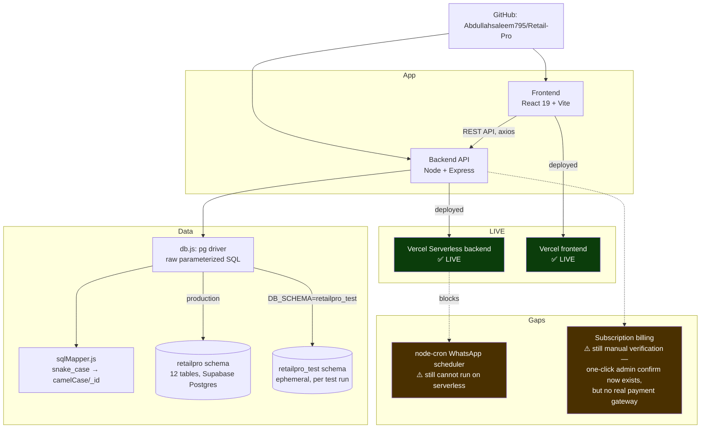
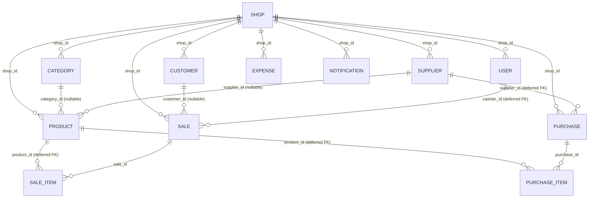

# RetailPro — Project Knowledge Graph

**Read this file (and `knowledge-graph.json`, the machine-readable source of truth) before re-deriving
project context from conversation history.** Update both whenever something changes — a decision, a
deployment status flip, a bug fix, a new module. Don't let this go stale; a wrong graph is worse than
no graph.

_Last updated: 2026-08-10 — two passes since the last update. (1) The camera barcode scanner was
rebuilt a second time, off `@zxing/browser` entirely and onto the native `BarcodeDetector` Web API
(via the `barcode-detector` polyfill package), fixing a StrictMode double-camera "split screen" bug
and — critically — **getting a real, user-confirmed successful scan of a physical barcode via a phone
camera**, closing an item that had been open since 2026-08-05. (2) A full subscription-billing arc:
admin email notifications (with a real SMTP send verified into the operator's own inbox), a
multi-bank-account system replacing the single hardcoded bank field (with hand-drawn brand-mark
recreations for JazzCash/EasyPaisa/Meezan/HBL, iterated twice for visual accuracy per direct user
feedback), Subscription & Billing split out of Settings into its own "Upgrade Plan" page, and a
one-click "Confirm & Activate" link (HMAC-signed, reusing `PLATFORM_ADMIN_KEY` as the signing secret)
sent to the admin so activating a request no longer means hunting down the shop and retyping the plan
by hand — still gated by the same admin key, still requires a human to actually verify the payment
landed (this was made explicit to the user directly: the system still cannot verify a real payment on
its own, no gateway exists). See the two new dated sections below for full detail._

---

## System map



## Data model



Every table is `shop_id`-scoped for multi-tenancy. `shops` also now carries subscription columns
(`subscription_plan`, `subscription_status`, `subscription_ends_at`, `last_payment_trx`) added by the
billing feature.

---

## Current status (read this first)

| Area | Status |
|---|---|
| Backend (Express + Postgres) | ✅ Complete, tested, deployed |
| Frontend (React/Vite) | ✅ Complete |
| Database | ✅ Live on Supabase (`retailpro` schema, project `tslqkswcrbihlavccjek`) |
| Tests | ✅ Documented as 48/48 passing (not re-run in this audit — no verified local DB credentials in this session) |
| **Vercel backend** | ✅ **LIVE** — verified `https://retail-pro-backend.vercel.app/api` responds `{success:true}` |
| **Vercel frontend** | ✅ **LIVE** — verified `https://retail-pro-blush.vercel.app` serves the SPA |
| Core POS/Inventory/Sales/Purchases/Customers/Expenses/Reports/Staff | ✅ Built, per README + code inspection |
| Offline POS (IndexedDB queue) | ✅ Built |
| Bilingual (English/Urdu RTL) | ✅ Built |
| PWA | ✅ Built |
| Performance pass (indexes, prefetch, skeleton loaders, compression) | ✅ Done, 5 commits, figures self-reported not re-benchmarked |
| QA pass (auth/POS/inventory/UI edge cases) | ✅ 100/100 self-reported in `QA_REPORT.md` |
| Subscription billing UI + backend | ✅ Built, request flow's 500 bug fixed, activation admin-gated, **one-click activation link + admin email + multi-bank picker added 2026-08-10** — still **manual verification** (no live gateway) |
| Platform admin console (`/admin`) | ✅ **New 2026-08-03**, extended 2026-08-05/2026-08-10 — cross-tenant subscription activation, `PLATFORM_ADMIN_KEY`-gated, now also manages bank accounts + notification email + one-click confirm links |
| WhatsApp Cloud API automated cron reports | ✅ **Fixed 2026-08-03** — `/api/cron/*` + Vercel Cron Jobs; needs `CRON_SECRET` set on Vercel to go live |
| WhatsApp wa.me manual deep-links (suppliers, low-stock, billing proof) | ✅ Built, still available as the manual path |
| Thermal ESC/POS receipt printing | ✅ **New 2026-08-03** — Web Bluetooth, Chrome/Edge only, **not yet tested on real hardware** |
| Real JazzCash/EasyPaisa merchant API | ❌ Not built — scaffold added 2026-08-03, needs real merchant credentials to activate |
| Multi-branch stock transfers | ✅ **New 2026-08-03** — manifest/logistics tracking, not live per-branch inventory splitting |
| WhatsApp phone number handling (Cloud API + wa.me) | ✅ **Fixed 2026-08-05** — was silently broken for every real (local-format) phone number, see dated section below |
| Subscription payment accounts (JazzCash/EasyPaisa/bank) | ✅ **New 2026-08-05** — admin-editable via `/admin`, was hardcoded before |
| Notification bell mark-as-read | ✅ **Fixed 2026-08-05** — opening the panel now actually clears the badge |
| Notification delete | ✅ **New 2026-08-05** — per-item delete, previously read-only-forever |
| Customer delete permission gating | ✅ **Fixed 2026-08-05** — was completely unguarded, any cashier could delete a customer |
| Camera barcode scanning | ✅ **Rebuilt again 2026-08-09 on the native `BarcodeDetector` Web API** (`barcode-detector` polyfill — replaces the 2026-08-05 `@zxing/browser` build entirely) — StrictMode "split screen" race fixed with a serialized teardown chain; **a real physical barcode scan via a phone camera was confirmed working live by the user** (previous open item now closed) |
| PIN quick-switch login | ✅ Built (predates this doc pass) — `POST /api/auth/pin-login`, 4-6 digit PIN, 5-attempt lockout (15 min), separate from password auth, see `authController.js` |
| Admin email notifications on upgrade request | ✅ **New 2026-08-10** — SMTP via `emailService.js` (nodemailer), recipient is admin-configurable (`platform_payment_accounts.notify_email`), real send verified into the operator's own Gmail inbox |
| Multi-bank payment accounts + brand-mark picker | ✅ **New 2026-08-10** — `platform_bank_accounts` table (was a single hardcoded bank), `PaymentMonogram.jsx` renders hand-drawn SVG recreations of JazzCash/EasyPaisa/Meezan/HBL (not licensed logo assets), any other bank falls back to a tinted-initials tile |
| Subscription & Billing moved to its own page | ✅ **New 2026-08-10** — `Upgrade.jsx` (`/dashboard/upgrade`), split out of `Settings.jsx`, same `shop:settings` (owner-only) nav gate |
| One-click "Confirm & Activate" admin link | ✅ **New 2026-08-10** — HMAC-signed token (`activationToken.js`, signed with `PLATFORM_ADMIN_KEY`) embedded in the email/WhatsApp ping; still requires the admin key to open, still requires a human to have actually verified the payment — **not** an automatic payment-verification mechanism, made explicit to the user |

---

## ✅ The two gaps flagged in the 2026-08-02 audit are now fixed

1. **WhatsApp automation on serverless — FIXED.** `backend/src/routes/cronRoutes.js` exposes
   `GET /api/cron/{low-stock,daily-report,weekly-report}`, secret-gated via `CRON_SECRET` (fails closed
   if unset). `backend/vercel.json` now has a `crons` array hitting them on the same schedule the old
   `node-cron` used (03:00/16:00/16:00-Sun UTC = 08:00/21:00/21:00-Sun PKT). This is the real fix — the
   `wa.me` deep-links from `feature_whatsapp_wame` still exist as a manual/on-demand path, but the
   *automated* reports now actually have somewhere to run. **Action needed**: `CRON_SECRET` must be set
   as a Vercel project env var (same value as `backend/.env`) for Vercel's own Cron Jobs to authenticate —
   implemented and locally verified, not yet confirmed configured on the live Vercel project.
2. **Subscription self-activation — FIXED.** The old `POST /api/shop/subscription/activate`
   (self-service, gated only by the caller's own `shop:settings` permission) is **removed**. Activation
   now lives at `POST /api/admin/shops/:shopId/subscription/activate`, gated by a `PLATFORM_ADMIN_KEY`
   header only the platform operator holds (`backend/src/middleware/platformAdmin.js`, fails closed if
   unset). A new `/admin` console page lets the operator review pending upgrade requests across all shops
   and activate or reject them. Verified end-to-end via a real browser walkthrough: request in Settings →
   appears in `/admin` → Activate → shop flips to active, drops out of the pending list.

**Bonus find while fixing #2**: the live Supabase `notifications_type_check` constraint didn't allow
`type='subscription'`, so `requestSubscriptionUpgrade` was **500ing on every real call** — the feature
had never actually worked in production. Also, `shops_subscription_plan_check` only allowed
`free/pro/enterprise` while the Settings UI offers a `basic` tier. Both fixed via a live migration,
mirrored into `schema.sql` (which had drifted from the live DB — see Decision log).

---

## 2026-08-05 pass: bug fixes + camera barcode scanner rebuild

1. **Fixed: every WhatsApp touchpoint was silently broken for real phone numbers.** Every phone
   number in the live database (`shops.whatsapp_number`, `suppliers.phone`, `customers.phone`) was
   stored in local Pakistani format (`03001234567`), but both `wa.me` links and the WhatsApp Cloud
   API require full international format with no leading trunk zero (`923001234567`). Passing the
   local form straight through made `wa.me` show "phone number shared via url is invalid" and would
   make a real Cloud API send fail outright. Fixed with a shared `normalizePakistaniPhone()` in
   `backend/src/services/whatsappService.js`, applied inside both `sendTextMessage()` and
   `buildWhatsAppUrl()`; also removed a second, unnormalized, duplicated phone-cleaning
   implementation that had drifted into `shopController.js`'s `requestSubscriptionUpgrade`. Verified
   live: Suppliers page's "💬 Order" button now generates a correct `wa.me/923001234567` link (was
   `wa.me/03001234567` before), and all three cron endpoints re-tested clean against a shop with
   fully local-format numbers.
2. **New: admin-editable subscription payment accounts.** JazzCash/EasyPaisa/bank account details
   shown to shop owners on the Settings billing card used to be hardcoded in the frontend. Added a
   `platform_payment_accounts` singleton table (`id integer PRIMARY KEY DEFAULT 1 CHECK (id=1)`),
   `GET/PUT /api/admin/payment-accounts` (admin-key gated) and `GET /api/shop/payment-accounts`
   (any signed-in shop user), and a new card in `/admin` (`AdminConsole.jsx`) to edit them. Verified
   end-to-end: admin edits a field → live DB updates → shop-facing Settings page reflects the change
   immediately; a plain shop JWT gets 401 on the write endpoint.
3. **Redesigned Settings.jsx's Subscription & Billing card.** The previous version was emoji-heavy
   and used an off-brand blue for the language toggle, inconsistent with the app's green brand and
   the rest of the design system. Rebuilt with `Settings.css` + design tokens instead of ~250 lines
   of inline styles. Also fixed a form-row label-alignment bug (a 2-line label pushed its input out
   of alignment with same-row siblings) with a global `.form-row .form-field label` rule in
   `frontend/src/index.css`.
4. **Fixed: notification bell never actually cleared the unread badge.** Opening the bell dropdown
   re-fetched notifications but never marked anything read — only clicking an individual item did,
   so the badge count stayed stuck even after the owner had visibly seen the list. Fixed so opening
   the panel now calls `markAllNotificationsRead()` automatically, matching standard notification-UX
   convention (`frontend/src/components/NotificationBell.jsx`).
5. **New: per-notification delete.** Notifications previously could only be marked read, never
   removed, so old test/low-stock alerts accumulated forever with no cleanup path for the shop
   owner. Added `DELETE /api/notifications/:id` (open to any signed-in shop user, same trust level
   as mark-as-read) and a delete control on each row in the bell dropdown.
6. **Fixed: customer delete had zero permission gating.** Every other entity's delete route
   (products, categories, suppliers, expenses) requires a `*_MANAGE` permission; `customerRoutes.js`
   had no `requirePermission` call at all on create/update/delete — any authenticated cashier could
   delete a customer record. Found while auditing delete capabilities across entities for an
   unrelated question about owner permissions. Added `PERMISSIONS.CUSTOMER_MANAGE`
   (`backend/src/config/permissions.js`), granted to `manager` role by default (owner already has
   all permissions), gated on the customer routes. Verified live: a cashier account now gets `403`
   on `DELETE /api/customers/:id`, owner still succeeds.
7. **Camera barcode scanner: rebuilt twice, two real library-level bugs found and fixed.** See
   `feature_barcode` in `knowledge-graph.json` for full detail. Summary:
   - Original bug reported ("camera opens but doesn't scan") traced to **React 18 StrictMode's
     dev-mode double-effect-invoke** creating two concurrent camera instances that both wrote into
     the same DOM target — first with `html5-qrcode` (two `<video>` elements layered on top of each
     other, visibly a doubled/frozen feed), fixed by clearing stale DOM nodes and chaining cleanup
     onto the in-flight start promise instead of racing it.
   - Also fixed: the scan-region box was a small fixed `300×200px` patch, centered — anything outside
     it (e.g. a barcode in the corner of frame, as shown in a user screenshot) was never even looked
     at by the decoder. Made it size dynamically to ~90% of the actual video frame.
   - User then explicitly asked to switch decode engines to ZXing. Swapped `html5-qrcode` for
     `@zxing/browser` + `@zxing/library` (the actively-maintained JS/TS port — `html5-qrcode` was
     already using a bundled/vendored copy of zxing-js internally with no direct control over it).
     Restricted `POSSIBLE_FORMATS` to retail 1D formats only (EAN-13/8, UPC-A/E, Code128/39, ITF,
     Codabar) and moved the camera to a proper React ref instead of a DOM-id string.
   - **Found the exact same StrictMode race again, in a different shape**: ZXing's `controls.stop()`
     unconditionally clears the shared `<video>` element's `srcObject` (`cleanVideoSource`), not
     scoped to "its own" stream — so the two StrictMode phantom instances again fought over the same
     video element, and whichever's delayed stop-cleanup fired last wiped out the other's
     already-working feed. Fixed with a `teardownChainRef` that serializes start/stop across effect
     invocations, so the second instance always waits for the first to fully release the camera
     before touching the shared ref.
   - **Found a genuine bug in `@zxing/browser@0.2.1` itself** (latest published version, not an old
     one): `HTMLCanvasElementLuminanceSource.tempCanvasElement` is compared against `null` in its
     lazy-init check, but the field is actually left `undefined` (never initialized), so the check
     never passes and `rotate()` throws `"Could not create a Canvas element."` on every single frame
     whenever `DecodeHintType.TRY_HARDER` is enabled. `TRY_HARDER` is precisely the hint meant to help
     with imperfect real-world images (the fixed-focus-webcam problem this whole investigation started
     from) — traded that capability away deliberately rather than ship a crash-looping decode path.
   - **Proved the decode pipeline itself is correct** via an offline test with zero camera/network
     dependency: hand-built a bit-perfect, checksum-valid EAN-13 barcode image in Node (no image
     library available to auto-generate 1D barcodes, so built the bar pattern directly from the
     EAN-13 spec) and fed it through the exact `MultiFormatReader` config the app uses — decoded
     correctly. This isolates any remaining real-world scan failures to camera capture conditions
     (focus/lighting/distance/motion), not the code.
   - Added a synthesized beep (`frontend/src/utils/beep.js`, Web Audio API, no audio asset) on
     successful add-to-cart, for both the camera-scan and hardware-scanner/manual-entry paths.
   - **Status as of this write-up: the offline decode logic is proven correct; a live successful
     real-world camera scan of a physical barcode was not yet confirmed working by the user** — the
     conversation moved on to a hardware-scanner feature request before that final confirmation
     happened. Flagged in Open items below.
8. **New: hardware "wedge" barcode scanner support in POS, with an honest limitation documented.**
   User asked for a "connect to Barcode Scanner" detection when clicking Scan. Established that
   USB/Bluetooth keyboard-emulation scanners (confirmed via a photo of the user's actual hardware —
   a handheld laser gun and a Honeywell Orbit-style dome scanner, both standard keyboard-wedge
   devices in their default mode) are **not detectable by any web API** — to the browser they're
   indistinguishable from a keyboard. No "is it connected" check was built, since a fake one would be
   dishonest. Built the real functional equivalent instead: `POS.jsx`'s search input now
   automatically regains focus after every action that could otherwise steal it (adding a product by
   clicking a card, closing the camera scanner, completing a sale), so a wedge scanner "just works"
   continuously with zero clicks needed, plus a plain-language hint under the search bar explaining
   both paths (scan directly vs. tap Scan for the camera).

---

## 2026-08-08 pass: expiry alerts, bulk import, POS UI polish

1. **New: Expiry Date Alerts.** Added `products.expiry_date` and `products.expiry_alert_days`
   (`schema.sql` + live Supabase). `ProductFormModal.jsx` gained Expiry Date + "alert N days before"
   fields (days field disabled until a date is set). New `GET /api/products/expiry-alerts` only
   returns a product once it's actually within its own configured window
   (`expiry_date - CURRENT_DATE <= expiry_alert_days`), including already-expired ones — a product
   with a date but no threshold, or no date at all, never shows up here. New `ExpiryAlerts.jsx` page
   groups triggered alerts into "N-Day Alert" sections with red "expired" / yellow "N days left"
   badges. Verified live for triggered, not-yet-triggered, and already-expired cases.
2. **New: Bulk Product CSV Import.** User asked "suggest what to add to make everything easier for
   the owner?" — offered 5 ideas, picked this one ("bulk product import, go for it and keep
   everything disciplined"). `POST /api/products/bulk-import` upserts by `(shop_id, sku)` — re-
   importing the same file to bulk-update prices/stock is a supported use case, not just one-time
   onboarding. Each row validated independently (name/sku required, prices ≥ 0, unit must be valid,
   `expiryAlertDays` requires an `expiryDate` on the same row); one bad row doesn't fail the batch —
   results come back as `{created, updated, failed}` plus a per-row error table with the actual CSV
   line number. New categories are auto-created and deduped via an in-request cache so 500 rows
   sharing one new category name don't create 500 categories. `BulkImportModal.jsx` offers a
   downloadable CSV template, client-side parsing (PapaParse), a friendly-header mapping ("Cost
   Price" → `costPrice`), a pre-import row-count preview, and a post-import summary/error table.
   Tested twice per explicit follow-up request ("test the bulk import on the browser"): once via
   direct API calls, once with real browser clicks and a real file upload — confirmed an actual DB
   row changed, then reverted it and deleted the test-created product. Full Jest suite (48/48)
   re-run clean both times.
3. **Fixed: a chain of POS cart bugs, each reported via a user screenshot, each with a distinct root
   cause** (see `pos_cart_polish_pass` in `knowledge-graph.json` for full detail):
   - "Remove doesn't work" → the handler was always correct; the tap target was 22×19px, well under
     the ~44px touch-target guideline this phone-first POS needs. Enlarged remove/qty buttons to
     32×32px.
   - "+/- not aligned" → `.pos-qty-control button` was missing the explicit flex-centering
     `.pos-remove-btn` already had.
   - Clicking a product scrolled the page back to the top every time → an earlier-session
     `refocusSearch()` call (for wedge-scanner support) used plain `.focus()`, which auto-scrolls an
     off-screen element into view by default. Fixed with `focus({ preventScroll: true })`.
   - "+/- still not aligned" (a **second**, different bug) → each cart row is its own independent CSS
     grid, so `auto`-sized columns computed different widths per row based on that row's own price
     text, shifting qty/total/remove out of alignment row-to-row. Fixed with fixed pixel grid columns
     instead of `auto`.
   - Severely truncated names ("Shan Birya...") plus a stray icon next to remove → only reproduced at
     the exact width (1000px) where the desktop 2-column layout locks the cart panel to a fixed
     380px (name column was down to 99.2px, confirmed via `getComputedStyle`). Fixed with a 2-line
     text clamp instead of single-line ellipsis, trimmed grid columns further, and added
     `padding-right` to the scrollable cart list — the "stray icon" was the browser's own scrollbar
     arrow-chrome rendering with no reserved space, directly on top of the remove button once the
     cart had enough items to scroll.
   - Every fix verified live at the specific viewport/cart-size that reproduces it, with real
     `getComputedStyle`/`getBoundingClientRect`/`scrollY` measurements, not just visual judgment.
4. **Changed: Payment Method from an always-visible chip row to a native `<select>`** defaulting to
   Cash, matching the existing Customer `<select>` pattern, per direct user request.
5. **Changed: sidebar color from dark navy (`#101828`) to grey (`#4b5563`)**, with nav-link text/hover
   colors adjusted for contrast (active state kept the brand green).
6. **Responsive audit**: checked the whole app at mobile/tablet widths; found one real bug —
   `.dash-topbar` had zero responsive handling and silently overflowed (clipping the logout button)
   at ≤768px even though the sidebar itself already collapsed correctly. Fixed with breakpoint rules
   hiding/truncating topbar content progressively at 768px and 480px. Confirmed no scroll overflow
   after, and no RTL/Urdu regression.
7. **Deferred, not built: "Target and Suggestion" monthly profit-goal feature.** User described a
   flow where the owner sets a monthly profit target and the app compares it to actual profit,
   flags best/worst sellers, and suggests a "strategy" — but asked to hear the implementation plan
   first ("fist tell me how will you do it?"). After the plan was explained and a clarifying
   question was asked (rule-based math suggestions vs. real AI-generated strategy text), the user
   said "leave it fo now" without answering — treated as a full defer, not a partial one. Nothing
   was scaffolded; don't resume building this from a stale summary without re-confirming scope.

---

## 2026-08-09 pass: POS receipt printing, percentage discount, dashboard/sales redesign

1. **New: POS post-checkout receipt modal.** User pointed out a real gap — after a POS checkout there
   was no way to give the customer a receipt at all, the cart just cleared silently. Added a modal
   that opens right after checkout with three options: **Print** (`window.print()` with a
   `@media print` rule that hides everything except the receipt, so the physical printout is clean),
   **Print via Bluetooth** (reused the existing `ThermalPrintButton`, previously only on the Sales
   history page), and **Download PDF** (reused the existing receipt endpoint). Works for offline-queued
   sales too — a receipt is built from the local cart data since a shopkeeper still needs a paper
   receipt even with no internet; PDF download is disabled with a note until that sale syncs and gets
   a real server id.
2. **Changed: POS Discount from a flat Rs amount to a percentage.** Owner types e.g. `10` for 10% and
   the Rs discount + final total compute automatically from the cart subtotal, clamped 0–100%.
   Backend/receipt still only ever see the resulting Rs amount — pure frontend input-model change.
3. **Redesigned Dashboard Home + Sales, adapted from a reference screenshot.** User shared a
   third-party admin-dashboard screenshot (Qcomart template) and asked for "UI exact like this, but
   adjust according to our web app data." Scoped via two clarifying questions first — which pages
   (chose Dashboard + Sales, matching the two screenshots shown) and whether to also restyle the
   sidebar to the reference's white look (kept the grey the user had explicitly set earlier this
   session instead). Built:
   - **`StatCard`** (`frontend/src/components/StatCard.jsx`) — label, static period tag, big value,
     optional sparkline. Sparkline is opt-in and only used for metrics with real daily history behind
     them (today's sales/transactions) — point-in-time snapshots (stock value, low-stock count) render
     without one rather than fake a trend line.
   - **`PaymentBadge`** (`frontend/src/components/PaymentBadge.jsx`) — colored dot + label per payment
     method, deliberately not literal card-network/JazzCash/EasyPaisa logos (no safe asset to embed).
   - **Sales page redesigned as an "Orders"-style view**: 4 stat cards backed by a new
     `GET /api/sales/summary` real aggregate (not a client-side count of whatever page happens to be
     loaded — that would silently under-report for shops with more than 50 sales), row checkboxes +
     header select-all, a real CSV **Export** of the checked/filtered rows, and a **+ New Sale**
     shortcut straight to POS. Receipt modal, refund flow, and PDF/thermal print were left untouched.
4. **Fixed: stat-card sparklines looked "rough."** Queried the live DB first rather than guessing at a
   rendering tweak — the demo shop only has sales on 5 of the last 14 days, so a zero-filled
   Area/Line chart was accurately but unflatteringly drawing a sharp spike-then-flat-line shape
   through 9 real zero-days. Switched to a small daily **bar** chart (older bars fade slightly toward
   today) — bars represent the same gappy data as normal-looking quiet-day bars instead of what read
   as a broken line.
5. **Fixed: the "Sales — Last 14 Days" chart drew a misleading spike.** Same root cause as #4 — the
   raw trend data only had 5 of 14 days, so Recharts spaced those sparse points evenly across what
   was really a 10-day gap. Zero-filled all 14 days, added compact Y-axis labels (`32k` not `32000`),
   nicer x-axis date labels at every-other-day intervals, and a smoother hover tooltip/active-dot.
   Tried curve type `natural` for extra smoothness first — it visibly overshot *below* the zero
   baseline right after the sharp post-peak drop (a known cubic-spline artifact) — reverted to
   `monotone`, which is specifically designed to never overshoot.
6. **Fixed: the 6 dashboard stat cards laid out unevenly.** The shared `.stat-grid`'s `auto-fit`
   column sizing picks however many columns fit the container width; at some widths that was 5,
   stranding the 6th card (Pending Purchases) alone on row 2 with a wide empty gap. Added a
   `.dashboard-stat-grid` override with a **fixed** column count per breakpoint (3 desktop / 2 tablet /
   1 mobile — all exact divisors of 6), scoped to the Dashboard only so Sales' 4-card and Reports'
   5-card grids (still on plain `.stat-grid`) were untouched. Also fixed a related alignment bug found
   in the same pass: a longer label ("Transactions Today") was wrapping to 2 lines while shorter
   sibling labels stayed on 1, pushing that card's value out of alignment — labels now stay single-line
   with an ellipsis fallback. Finally, cards with a sparkline (more content) were rendering taller than
   plain-number cards in a *different* row — CSS Grid only stretches items to match within their own
   row — fixed with a **fixed** `height: 168px` on every card instead of `min-height`.
   Verified with real measurements after each fix: computed `grid-template-columns` per breakpoint,
   `getBoundingClientRect()` heights (all 6 cards = 168px), label heights (all single-line), and a
   live DOM path/stroke inspection to rule out a suspected sparkline color bug that turned out to just
   be anti-aliasing at 36px height.

---

## 2026-08-09 pass (part 2): stat-card clipping fix, then a full Dashboard/sidebar/topbar redesign

1. **Fixed: "Rs 0" and "0" were visibly cut off, and bars showed on a card with no sales today.**
   The `168px` fixed card height from the pass above turned out to be a few px too tight for a
   sparkline card's real content stack (measured: ~178px needed). Flexbox's default `flex-shrink:1`
   was silently compressing the value text's box below its own line-height to force it to fit
   (30.4px rendered vs 43.52px natural), and `overflow:hidden` cropped the digits. Fixed by
   increasing the card height to `184px` (measured properly this time) and adding `flex-shrink:0` to
   the value element as a permanent guard — if content ever overflows again, the sparkline should
   give way, never the number. Separately, Today's Sales / Transactions Today only show their
   sparkline once *today itself* has a non-zero value — showing 14-day history bars next to a "Rs 0"
   headline (both explicitly "Today"-scoped) read as contradictory.
2. **Full redesign: Dashboard, sidebar, and topbar to match a second reference screenshot.** User
   shared a more elaborate admin-dashboard reference (welcome banner, 5 icon-square stat cards, sales
   chart + metric strip, top-products list, recent-orders table, stock donut, icon+label sidebar,
   topbar search/dark-mode/shop-switcher/avatar) and asked to match it, adapted to real data, keeping
   the existing grey sidebar.
   - **Sidebar**: icon+label nav rows, a working hamburger collapse toggle (manually triggerable at
     any width, reusing the same 72px icon-rail treatment the `<=768px` breakpoint already had).
     Header shows the logged-in user's name + role (see item 3) instead of app branding.
   - **Topbar**: a *real* product search (debounced, hits the existing `search=` param on
     `GET /api/products`, live dropdown of name/SKU/price/stock) — not a decorative box. A user-avatar
     dropdown menu (Profile/Logout) replacing the old plain text link. A shop-name badge.
   - **Dashboard Home**: welcome banner with a live rolling-7-day date range (recomputed from the
     real system date on every render, not a fixed string); 5 new `TrendStatCard`s (Total Sales,
     Orders, Profit, Low Stock, Customers) with real week-over-week trend percentages from new
     backend aggregates (`weekComparison` in `reportController.js` — rolling 7-day "this week"/"last
     week" windows, not calendar Mon–Sun weeks); a Sales Overview chart + 4-metric strip (swapped the
     reference's "Conversion Rate" for "Items Sold" — this POS has no visit/traffic data to compute a
     real conversion rate from, so a real available metric was substituted rather than a fake one);
     Top Selling Products ranked list (generic package icon, since no product-image system exists);
     Recent Orders preview table; a Stock Summary donut chart.
   - **Deliberately not built**: dark mode (no dark theme/token set exists anywhere in this codebase)
     and a shop-switcher dropdown (this app is single-shop per account, nothing to switch between) —
     flagged to the user instead of shipping toggles/dropdowns that would do nothing.
   - **Bugs found and fixed during verification**: two stat cards briefly rendered as blue underlined
     links because a CSS class name was reused from `StatCard.css`, which the Dashboard page never
     imports (fixed with a dedicated class in `TrendStatCard.css` instead); a React "key prop spread
     into JSX" console warning from spreading a card-config object that carried its own `key` field
     (fixed by destructuring `key` out before the spread). A moment where the sidebar-collapse toggle
     *appeared* broken turned out to be a stale Vite HMR/Fast-Refresh state, resolved by a full dev
     server restart — not a real code bug.
   - **Verified end-to-end**: completed a real POS sale (3× Cola 1.5L, Rs 480), waited past the
     15-second report cache window, and confirmed Total Sales/Orders/Profit/Items Sold and the Recent
     Orders table all updated to the exact expected values on the Dashboard — then reverted the test
     sale and restored stock via SQL.
3. **Changed (twice, same day): what the sidebar header displays.** First changed from the static
   "Retail Pro" app name to the shop's name (matching the reference's branding slot). Then, per a
   direct follow-up request, changed again to show the *user's* name and their role/designation
   (Owner/Manager/Cashier) instead — the shop name was not removed from the app, just relocated to
   stay only in the topbar badge.
4. **Fixed: the notification bell was a literal emoji.** `NotificationBell.jsx`'s bell icon was a
   `🔔` emoji character inside a `<span>`, not an icon font or SVG — user correctly noticed "the bell
   icon seems like an emoji" because it was one. Replaced with `react-icons/fi`'s `FiBell` to match
   every other icon in the redesigned topbar/sidebar.

---

## 2026-08-09 pass (part 3): camera barcode scanner rebuilt again, on the native `BarcodeDetector` API

1. **Rebuilt the camera scanner off `@zxing/browser` entirely, per direct user request** ("use the
   best library that only professionals use... and don't divide the screen into two when scanning").
   Replaced `html5-qrcode` → `@zxing/browser` (2026-08-05) with the `barcode-detector` npm package,
   which ponyfills the browser's native, hardware-accelerated `BarcodeDetector` Web API when it exists
   (Chrome/Edge — on-device, no WASM download) and falls back to a bundled ZXing-WebAssembly decoder
   otherwise (Safari/Firefox) — same code path either way (`import 'barcode-detector'` just fills in
   `window.BarcodeDetector` if it isn't already native), zero app-level branching. Chosen over
   Scandit/Dynamsoft (paid commercial SDKs) after the user delegated the choice ("choose the best") —
   free, no license, and the native engine on Chrome/Edge outperforms a pure-JS decoder anyway.
2. **Fixed the actual "splits into two" symptom**, which was a React 18 StrictMode dev-mode
   double-effect-invoke leaving two camera streams both capable of writing into the DOM/video element
   briefly — same root-cause *family* as the 2026-08-05 ZXing StrictMode race, fixed the same way: a
   `teardownChainRef` (a `useRef` holding a chained promise) that makes each new scanner instance await
   the *previous* instance's full camera-teardown promise before requesting its own `getUserMedia`
   stream. Verified live in real Chrome (not the sandboxed preview pane, which blocks camera access
   entirely) that exactly one `<video>` element and one live track exist at a time, and that Cancel
   fully releases the camera.
3. **Proved the decode pipeline correct** the same way as 2026-08-05 — hand-built a bit-perfect,
   checksum-valid EAN-13 barcode drawn to an off-screen `<canvas>`, fed through the exact same
   `BarcodeDetector` instance/config the app uses, decoded correctly on the first attempt. This
   isolated the next real-world failure (a laptop's fixed-focus 640×480 webcam not detecting a real,
   physically-present barcode) to camera hardware/capture conditions, not a code bug — confirmed via
   `track.getSettings()` that the webcam was hardware-capped at 640×480 even after requesting
   1920×1080, giving only ~2px per barcode module.
4. **Closed the open item from 2026-08-05**: got a real, live, user-confirmed successful scan. Since
   the laptop webcam's resolution was a genuine hardware ceiling (not fixable in software), pivoted to
   testing via the user's **phone** camera instead — required a real HTTPS deployment (`getUserMedia`
   needs a secure context; a LAN-IP dev server over plain HTTP would not reliably grant camera
   permission on mobile), so this fix was deployed to production specifically to enable that test.
   Added a real test product (`Test Scan Item`, barcode `0792625892862`) to the user's actual
   production shop, scanned it live via phone camera — detected correctly, matched the product, added
   to the POS cart, and the user completed a real checkout. Test sale/product cleaned up afterward
   (stock restored, sale + sale_items rows deleted).
5. **Removed `html5-qrcode`, `@zxing/browser`, `@zxing/library` from `package.json` entirely** —
   confirmed via grep that nothing else in `frontend/src` still imported them before removing. The
   `zxing_tryharder_bug` node below (a real, confirmed-still-present upstream bug in
   `@zxing/browser@0.2.1`) is now **historical only** — that exact library is no longer in this
   codebase, though the *pattern it documents* (a third-party camera-decode library with an
   uninitialized-field bug) is still worth knowing about if any future decode library is evaluated.

---

## 2026-08-10 pass: admin email notifications, multi-bank payment picker, dedicated Upgrade page, one-click activation

1. **New: admin email notification on every upgrade request.** User asked to be emailed when a shop
   buys Pro/Enterprise. Added `backend/src/services/emailService.js` (nodemailer, same
   graceful-degradation pattern as `whatsappService.js` — logs and no-ops if SMTP env vars are unset
   rather than throwing), wired into `requestSubscriptionUpgrade` alongside the existing WhatsApp ping.
   The recipient is **not** hardcoded — it's a new `platform_payment_accounts.notify_email` column,
   editable by the admin in `/admin` (Payment Accounts card). Verified with a real send: SMTP
   configured against the operator's own Gmail (host `smtp.gmail.com`, a 16-char Google App Password —
   never entered by the assistant directly, per the credential-handling rule; the user pasted their own
   app password into `backend/.env` themselves), a live email actually landed in their inbox with
   subject `"{Plan} plan purchased by {owner name}"`.
2. **New: multi-bank payment accounts, replacing the single hardcoded bank field.** The live
   `platform_payment_accounts` row had `bank_name = "Meezan / HBL"` — two banks jammed into one text
   field, because the old schema only had room for one. Added a proper `platform_bank_accounts` table
   (list, not singleton), full CRUD at `/api/admin/bank-accounts` (admin-key gated), a shop-facing list
   via the existing `GET /api/shop/payment-accounts` (now also returns a `banks` array), and a
   `BankAccountsCard` in `/admin` to manage them. A migration backfilled the existing "Meezan / HBL"
   value as one bank row so nothing disappeared from the shop's upgrade screen on deploy.
3. **New: `PaymentMonogram.jsx` — brand-mark tiles for the payment picker, not real logo assets.**
   Deliberately not remote/embedded trademarked logo images (licensing risk, and a broken `` on a
   billing screen looks worse than a clean fallback). For the four payment methods this platform
   actually settles through (JazzCash, EasyPaisa, Meezan, HBL), hand-drew SVG recreations using each
   brand's real colors — the same nominative-use approach any checkout page uses to show a simplified
   Visa/Mastercard mark. Iterated **twice**: the first pass was a rough gestural approximation the user
   directly rejected ("they aren't same... make the monogram exact"); rebuilt using a side-by-side test
   page against the user's own reference images for closer shape fidelity (JazzCash's interlocking
   paisley crescents, EasyPaisa's asymmetric "e" with a green swoosh, Meezan's 3-triangle mountain
   emblem inside a purple/green ring, HBL's double right-pointing chevron) before porting into the real
   component. Any bank without a hand-drawn mark (i.e. every bank except these four) falls back to a
   tinted-initials tile (`bankBrand.js` — ~25 known Pakistani banks get real brand colors, anything else
   gets a stable hash-derived color) — no licensing needed for the fallback path at all.
4. **Changed: Subscription & Billing moved out of Settings into its own "Upgrade Plan" page.** User
   flagged this as its own distinct workflow buried inside shop-profile fields. Moved the entire card
   (plan comparison, payment-method picker, upgrade-request form) from `Settings.jsx` into a new
   `Upgrade.jsx` at `/dashboard/upgrade`, with its own sidebar nav entry (credit-card icon) using the
   *same* `shop:settings` permission gate Settings used — owner-only on the backend, so visibility
   didn't change, only location. `Settings.jsx` now only has Language + Shop Profile.
5. **New: one-click "Confirm & Activate" admin link.** User asked for automatic activation once a shop
   pays; after being walked through why *fully* automatic isn't safe without a real payment gateway
   (see decision log), the user picked the safest available middle ground: a signed link the admin
   clicks to activate instantly, rather than manually finding the shop and retyping plan/duration.
   `backend/src/utils/activationToken.js` signs `{shopId, shopName, plan, durationMonths,
   paymentChannel, transactionId}` with HMAC-SHA256 using `PLATFORM_ADMIN_KEY` as the secret (no new
   env var — the key already exists, is already secret, and rotating it naturally invalidates
   outstanding links too). The link (`/admin/confirm/:token`) is embedded in both the WhatsApp ping and
   the admin email (a real styled button in the HTML body). Opening it still requires unlocking the
   console with `PLATFORM_ADMIN_KEY` — the token is not itself a credential, only a pre-fill — and the
   signature is independently re-verified server-side (`confirmActivationToken` in `adminController.js`)
   before any database write happens, so a tampered/forged/expired token (tested: garbage token → 400,
   manually-crafted expired token → 400, missing admin key → 401) can never activate anything.
   `performActivation()` was factored out of `activateSubscription` so the manual-form path and the
   one-click-link path share one write path and one in-app-notification path, and can never drift.
6. **New: owner-facing notification wording, at both ends of the request.** User asked that the shop
   owner get a "you'll shortly receive a confirmation message"-style notification on submit, and a
   distinct one once the admin confirms. Both already had an in-app `notifications` insert, but the
   copy didn't set that expectation. Request-submit now inserts `"Upgrade Request Received"` —
   *"We've received your {Plan} plan request ({channel}, TRX: {id}). You'll get a confirmation
   notification here as soon as it's verified and activated."* — and the immediate toast on submit
   echoes the same reassurance. Activation now inserts `"Subscription Confirmed"` — *"Your payment has
   been confirmed! The {Plan} plan is now active until {date}."* — with separate wording for a
   complimentary/free grant (`"You've been given free access..."`, since "confirmed" would be
   misleading when the owner never submitted anything for review). Added `subscription` to
   `NotificationBell.jsx`'s `TYPE_LABELS` map so these render with a proper pill instead of the raw
   type string. Verified live end-to-end, including the 15-second `notifications` response cache
   (`notificationController.js` — inserts don't bust it, only `deleteNotification` does) — waited it
   out rather than misreading a stale pre-confirm response as a bug.
7. **Explicit, direct clarification given to the user: the system still cannot verify a real payment.**
   Asked "how will you know the payment is actually made?" — answered plainly: nothing here checks a
   bank/wallet balance. The shop owner's transaction ID is a claim, not proof; the one-click link only
   removes *lookup and retyping* friction, not the *judgment call*. The admin is still expected to
   check their own JazzCash/EasyPaisa/bank account before clicking confirm — the confirm page's own
   copy says so ("Make sure this payment actually landed in your account before confirming"). True
   automatic verification needs a real payment gateway (JazzCash/EasyPaisa Merchant API, or an
   aggregator like Safepay/PayFast) sending a signed webhook — not built, no merchant credentials exist.

---

## Key facts an agent should know before touching this project

- **This Supabase project hosts another, unrelated app** in the `public` schema. RetailPro lives entirely
  in a separate `retailpro` schema. Never write to `public.*` here.
- **Use the Supabase pooler host**, never `db.<ref>.supabase.co` directly — IPv6-only, times out on most
  networks.
- **`backend/src/db/schema.sql`** is the canonical DDL, templated with `{{SCHEMA}}`. Don't hand-edit either
  the live or test schema directly.
- **Numeric columns need the type-parser fix** in `config/db.js` (OID 1700 → float).
- **`sqlMapper.js`'s regex excludes position 0** so a literal `'_id'` key inside `jsonb_build_object()`
  isn't mangled into `'Id'`.
- **Demo login:** `demo@retailpro.pk` / `demo1234` (owner), `cashier@retailpro.pk` / `demo1234`.
- **Secrets** live in `backend/.env` (gitignored). Supabase DB password was pasted in chat during original
  setup — still worth rotating before this holds real shop data.
- **Subscription activation is admin-gated, NOT self-service** (fixed 2026-08-03, see gap #2 above)
  — this note used to say the opposite; corrected 2026-08-05. Don't describe it as insecure without
  re-checking `platformAdmin.js` first.
- **WhatsApp Cloud API automated reports run via Vercel Cron Jobs** (fixed 2026-08-03, see gap #1
  above) — this note used to say they were dead in production; corrected 2026-08-05. Still requires
  `CRON_SECRET` to be set as a Vercel env var to actually fire on the live deployment (see Open items).
- **Every phone number in the app is stored/entered in LOCAL Pakistani format** (`03001234567`, what a
  shopkeeper actually types), but `wa.me` links and the WhatsApp Cloud API both require full
  international format (`923001234567`, no leading 0, no `+`). Always go through
  `normalizePakistaniPhone()` in `whatsappService.js` — never build a WhatsApp URL or API call from a
  raw phone column. This exact bug silently broke every WhatsApp touchpoint in production until fixed
  2026-08-05.
- **React 18 StrictMode + any imperative camera/video library is a known trap.** Dev-mode double-invokes
  every effect (mount → cleanup → mount), and camera-decoding libraries (previously `html5-qrcode`, then
  `@zxing/browser`, now `barcode-detector`'s native `BarcodeDetector`) manipulate the DOM/video element
  directly rather than through React state. If cleanup checks a synchronous "is it running" flag before
  an async `start()` has resolved, or if teardown from a stale instance runs after a newer instance
  already attached its stream, you get two competing camera feeds or a wiped-out working one. See
  `feature_barcode`/`BarcodeScanner.jsx`'s `teardownChainRef` pattern (present in every rebuild of this
  component so far) before touching it again.
- **`@zxing/browser`/`@zxing/library` are NO LONGER USED as of 2026-08-09** — the camera scanner was
  rebuilt onto the native `BarcodeDetector` Web API (`barcode-detector` package). The
  `@zxing/browser@0.2.1` `TRY_HARDER` bug documented below/in `knowledge-graph.json` is now **historical
  only** — don't spend time re-checking whether it's fixed upstream, that library isn't in this codebase
  anymore. The pattern (imperative library, uninitialized-field bug) is still a useful cautionary example
  if evaluating any *future* decode library.
- **`PLATFORM_ADMIN_KEY` now does double duty**: it still gates every `/api/admin/*` route (unchanged),
  and as of 2026-08-10 it's also the HMAC-SHA256 signing secret for the one-click activation token
  (`backend/src/utils/activationToken.js`). This was a deliberate choice to avoid a second secret — the
  key is already operator-only and already secret, and rotating it naturally invalidates any outstanding
  activation links too. If `PLATFORM_ADMIN_KEY` is ever rotated, every previously-sent activation link
  becomes invalid (fails signature verification) — that's expected, not a bug.
- **`PaymentMonogram.jsx`'s JazzCash/EasyPaisa/Meezan/HBL marks are hand-drawn SVG recreations, not
  real logo assets.** Deliberate — redistributing actual trademarked brand artwork wasn't done; these are
  built from scratch using each brand's real colors (same nominative-use approach any checkout page uses
  for a simplified card-network icon). Any bank without one of these four falls back to a tinted-initials
  tile from `bankBrand.js`. If asked to make these "exact," treat it as "closer visual fidelity to the
  real mark," not "byte-identical to a supplied image" — that was already interpreted this way once
  (2026-08-10) after the first pass was rejected as too rough.
- **The admin's notification email is NOT an env var** — it's `platform_payment_accounts.notify_email`,
  editable by the admin in `/admin` → Payment Accounts. `EMAIL_HOST/PORT/USER/PASS/FROM` in
  `backend/.env` configure the *sending* SMTP account (the operator's own Gmail as of 2026-08-10); the
  *recipient* is this DB field, which can be blank (the email silently no-ops, same graceful-degradation
  pattern as `whatsappService.js` when WhatsApp creds are unset).
- **Customer delete/create/update had zero permission gating until 2026-08-05** — if you're auditing
  permission coverage across entities again, check `customerRoutes.js` first; it's the one that
  historically drifted from the `requirePermission(PERMISSIONS.*_MANAGE)` pattern every sibling route uses.
- **`backend/src/db/schema.sql` drifted from the live DB again, as of 2026-08-10 — found and fixed the
  same session.** The `platform_bank_accounts` table and `platform_payment_accounts.notify_email` column
  had both been added to the **live** Supabase schema via direct migrations, but neither was mirrored
  into `schema.sql` — the exact same class of bug that caused a real production 500 in the 2026-08-03
  pass. Fixed immediately (mirrored both, matching live column types exactly) and verified by rebuilding
  `retailpro_test` from the file and re-running the full 48-test suite clean. Still worth remembering:
  **a passing test suite alone never proves schema.sql is in sync** — it only proves the tests that exist
  don't touch the drifted part. Re-check `schema.sql` against the live DB after any `apply_migration` call,
  don't assume the graph note above means this can't happen a third time.

---

## Decision log

Chronological, most-recent-relevant first. Full detail in `knowledge-graph.json` → `decisionLog`.

1. **Verified both Vercel deployments live via direct HTTP check** (2026-08-02) — the graph had drifted
   out of sync with reality; PROJECT_PROGRESS.md/README already claimed live URLs, confirmed directly
   rather than trusting docs at face value.
2. **wa.me deep-links added instead of fixing the cron/serverless conflict** (commit `67db8e7`) — cheapest
   path to a working WhatsApp feature given Vercel serverless can't run `node-cron`; trades automation for
   a manual click. Underlying scheduler problem still open.
3. **Subscription billing built as manual record-and-WhatsApp-ping, not a gateway integration** (commit
   `14629cf`) — no JazzCash/EasyPaisa merchant credentials exist. Functional gap: `activateSubscription`
   has no visible admin-only guard.
4. **Migrated MongoDB → Supabase Postgres** on explicit instruction — kept Express/JWT/permissions
   unchanged, only the data layer moved.
5. **Raw `pg` driver, not Supabase's JS client or an ORM** — the JS client goes through PostgREST, which
   only exposes `public` by default.
6. **Dedicated `retailpro` schema, not `public`** — collision risk with the pre-existing unrelated app.
7. **Pooler host required** — direct host is IPv6-only.
8. **Deferred FK constraints** on four columns — a full shop cascade-delete races two independent FK paths.
9. **Global NUMERIC type parser** — `pg` returns `NUMERIC` as strings by default.
10. **Tests run against a real, isolated Postgres schema**, not mocks.
11. **User pivoted the backend deployment target to Vercel Serverless** (commit `e837f35`) — now live,
    but the cron consequence (#2 above) was never resolved, only worked around.
12. **User replaced native `window.confirm()` with `ConfirmModal`** (commit `ce57f35`) across every
    dashboard delete/remove action.

---

## Bugs found and fixed (Mongo→Postgres migration)

| Bug | Found via | Fix |
|---|---|---|
| Cascade-delete ordering violation | Seed script re-run cleanup failing with a real FK error | `DEFERRABLE INITIALLY DEFERRED` on 4 FKs |
| `search_path` race on connect | Genuine "client already executing a query" warning | Set via `pg` startup `options` |
| Numeric columns returned as strings | 12 failing tests | Global type parser for OID 1700 |
| Nested `_id` → `Id` mangling | Found by manual inspection, no test caught it | Regex excludes position 0 in `sqlMapper.js` |

---

## Where things are

```
backend/
├── server.js                    Entry point (long-running; NOT what Vercel runs)
├── api/index.js                  ⭐ Vercel Serverless entry point — exports `app`, no app.listen(),
│                                    never calls connectDB()/startScheduler() (see gap #1)
├── vercel.json                   Rewrites /api/* -> /api/index.js — LIVE at retail-pro-backend.vercel.app
├── render.yaml                   Superseded, unused
├── src/
│   ├── app.js                   Express app, middleware, routes
│   ├── config/db.js              pg.Pool, query()/withTransaction(), numeric type parser
│   ├── config/permissions.js     Role defaults + grantable permission list
│   ├── db/schema.sql              ⭐ canonical DDL — source of truth for BOTH schemas + composite indexes
│   ├── controllers/               11 files incl. shopController.js (subscription billing)
│   ├── services/whatsappService.js  Cloud API (cron, non-functional on serverless) + wa.me link builder
│   ├── utils/sqlMapper.js         snake_case → camelCase/_id
│   └── utils/seed.js              Demo data
└── tests/                        48 Jest+supertest tests (auth, tenancy, permissions, sales)

frontend/
├── src/pages/dashboard/Settings.jsx   Subscription plan picker + upgrade request UI
├── src/pages/dashboard/Suppliers.jsx  wa.me reorder deep-links
├── src/layouts/DashboardLayout.jsx    Idle + hover link prefetching for instant nav
├── src/components/ConfirmModal.jsx    Replaces window.confirm() everywhere
└── src/components/SkeletonLoader*     Perf-pass loading states
                                   LIVE at retail-pro-blush.vercel.app

docs/
├── knowledge-graph.json          ⭐ machine-readable source of truth
├── knowledge-graph.md            ⭐ this file
└── design-brief.md               Material 3 design brief, all 17 screens

PROJECT_OVERVIEW.md               Business/pitch doc + SaaS monetization models
PROJECT_PROGRESS.md               Self-reported ~97% completion status (updated 2026-08-03)
QA_REPORT.md                      Self-reported 100/100 QA pass
```

### New in the 2026-08-03 hardening pass (not yet reflected in the tree above)

```
backend/src/
├── middleware/platformAdmin.js        requirePlatformAdmin - x-admin-key gate, fails closed
├── controllers/adminController.js     Cross-tenant: list shops, activate/reject subscriptions
├── controllers/branchController.js    Branches + stock transfer manifests
├── routes/adminRoutes.js              /api/admin/*
├── routes/branchRoutes.js             /api/branches/*
├── routes/cronRoutes.js               /api/cron/* - CRON_SECRET-gated, called by Vercel Cron Jobs
└── services/paymentProviders/         index.js, manualProvider.js, jazzcashProvider.js (stub),
                                        easypaisaProvider.js (stub) - see payment_provider_scaffold node

frontend/src/
├── pages/AdminConsole.jsx             /admin - outside ProtectedRoute, separate admin-key auth
├── pages/dashboard/Branches.jsx       Branches + transfer manifest UI
├── api/branches.js
├── components/ThermalPrintButton.jsx  Next to "Download PDF" in Sales.jsx's receipt modal
├── utils/escpos.js                    ESC/POS command builder (58mm/80mm)
└── utils/useThermalPrinter.js         Web Bluetooth GATT connect/print hook
```

### New/changed in the 2026-08-05 pass (not yet reflected in the tree above)

```
backend/src/
├── config/permissions.js              + CUSTOMER_MANAGE permission (was completely unguarded before)
├── controllers/adminController.js     + getPaymentAccounts/updatePaymentAccounts
├── controllers/notificationController.js  + deleteNotification
├── controllers/shopController.js      + getPaymentAccounts; requestSubscriptionUpgrade now reuses
│                                         the shared normalizePakistaniPhone() instead of a duplicated,
│                                         unnormalized regex
├── routes/customerRoutes.js           create/update/delete now gated by requirePermission(CUSTOMER_MANAGE)
├── routes/notificationRoutes.js       + DELETE /:id
└── services/whatsappService.js        + normalizePakistaniPhone() - applied in sendTextMessage() AND
                                          buildWhatsAppUrl(); this was the systemic phone-format bug fix

frontend/src/
├── components/BarcodeScanner.jsx      Rebuilt on @zxing/browser + @zxing/library (was html5-qrcode);
│                                         teardownChainRef serializes camera start/stop across React
│                                         StrictMode's double-effect-invoke; dynamic ~90%-of-frame scan
│                                         box; POSSIBLE_FORMATS restricted to retail 1D formats;
│                                         deliberately NOT using DecodeHintType.TRY_HARDER (upstream bug)
├── components/NotificationBell.jsx    Opening the panel now marks all read; added per-item delete
├── utils/beep.js                      NEW - Web Audio synthesized beep, no audio asset
├── pages/dashboard/POS.jsx            Beep wired into both scan paths; search input auto-refocuses
│                                         after cart/scan/checkout actions for hardware wedge scanners;
│                                         hint text explaining hardware-scanner vs. camera paths
├── pages/dashboard/Settings.jsx       Subscription & Billing card rebuilt (Settings.css, design
│                                         tokens, no more inline styles/emoji); payment accounts now
│                                         fetched live instead of hardcoded
├── pages/AdminConsole.jsx             + PaymentAccountsCard (edit JazzCash/EasyPaisa/bank details)
├── api/shop.js                        + getPaymentAccounts
├── api/notifications.js               + deleteNotification
└── index.css                          + .form-row .form-field label alignment fix (global, scoped to
                                          multi-column form rows only)
```

### New/changed in the 2026-08-08 pass (not yet reflected in the tree above)

```
backend/src/
├── db/schema.sql                      + products.expiry_date, products.expiry_alert_days
├── controllers/productController.js   + getExpiryAlerts, bulkImportProducts (upsert-by-sku, per-row
│                                         validation, category auto-create+dedup cache)
├── controllers/categoryController.js  clearShopCategoryCache now exported (used by bulk import)
└── routes/productRoutes.js            + GET /expiry-alerts, POST /bulk-import (both before /:id)

frontend/src/
├── components/ProductFormModal.jsx    + Expiry Date + Expiry Alert (days before) fields
├── components/BulkImportModal.jsx     NEW - CSV template download, PapaParse client-side parse,
│                                         friendly-header mapping, preview, post-import summary/errors
├── components/BulkImportModal.css     NEW
├── pages/dashboard/ExpiryAlerts.jsx   NEW - grouped-by-threshold alert list, red/yellow badges
├── pages/dashboard/ExpiryAlerts.css   NEW
├── pages/dashboard/Inventory.jsx      + "Import Products" button, opens BulkImportModal
├── pages/dashboard/POS.jsx            refocusSearch now uses focus({preventScroll:true}); Payment
│                                         Method chip row replaced with a native <select>
├── pages/dashboard/POS.css            Remove/qty buttons enlarged to 32x32px + flex-centered; cart
│                                         row grid columns switched from auto to fixed pixel widths;
│                                         cart item name uses a 2-line clamp instead of ellipsis;
│                                         scrollable cart list gained padding-right for the scrollbar
├── layouts/DashboardLayout.css        Sidebar background #101828 -> #4b5563 (grey); new responsive
│                                         rules for .dash-topbar at <=768px and <=480px
└── api/products.js                    + getExpiryAlerts, bulkImportProducts
```

### New/changed in the 2026-08-09 pass (not yet reflected in the tree above)

```
backend/src/
├── controllers/saleController.js      + getSalesSummary (real aggregate: total/new/completed/
│                                         refunded counts, cache key `${shopId}:summary` so
│                                         clearShopSalesCache's prefix match also invalidates it)
└── routes/saleRoutes.js               + GET /sales/summary (before /:id)

frontend/src/
├── components/StatCard.jsx            NEW - label + period tag + value + optional daily-bar
│                                         sparkline (only for metrics with real history)
├── components/StatCard.css            NEW
├── components/PaymentBadge.jsx        NEW - colored dot + label per payment method
├── components/PaymentBadge.css        NEW
├── api/sales.js                       + getSalesSummary
├── pages/dashboard/DashboardHome.jsx  Stat cards rebuilt on StatCard; 14-day trend now zero-filled,
│                                         compact axis labels, monotone curve (not natural - see
│                                         2026-08-09 pass notes); .dashboard-stat-grid fixed 3/2/1
│                                         column layout
├── pages/dashboard/DashboardHome.css  + .dashboard-stat-grid breakpoint rules
├── pages/dashboard/Sales.jsx          Redesigned as an "Orders"-style view - StatCard row, row
│                                         checkboxes + select-all, CSV Export, PaymentBadge in the
│                                         Payment column, "+ New Sale" link to POS
├── pages/dashboard/Sales.css          NEW - .checkbox-col, .sales-stat-grid
├── pages/dashboard/POS.jsx            + post-checkout receipt modal (Print/Bluetooth/PDF, works
│                                         offline too); Discount field changed from Rs to percent
│                                         (discountPercent state, clamped 0-100)
└── pages/dashboard/POS.css            + .pos-receipt-print styles and @media print isolation rules
```

### New/changed in the 2026-08-09 pass, part 2 (not yet reflected in the tree above)

```
backend/src/
└── controllers/reportController.js    getDashboardOverview extended: + weekComparison
                                          (thisWeek/lastWeek sales/orders/profit/itemsSold/
                                          newCustomers), + stockBreakdown, + summary.totalCustomers,
                                          + recentSales, bestSellers now includes sku

frontend/src/
├── components/TrendStatCard.jsx       NEW - icon-square stat card with a trend %/arrow badge and
│                                         a "vs last week X" comparison line
├── components/TrendStatCard.css       NEW
├── components/StatCard.css            + .stat-card-v2 height 168px -> 184px (fixed a real text-
│                                         clipping bug), + flex-shrink:0 on the value as a guard
├── components/NotificationBell.jsx    Bell icon: literal 🔔 emoji -> react-icons/fi FiBell
├── components/NotificationBell.css    .notif-bell: font-size sizing -> flex centering (for the SVG)
├── layouts/DashboardLayout.jsx        Full rewrite - icon+label nav, hamburger collapse toggle,
│                                         TopbarSearch (real product search + dropdown), UserMenu
│                                         (avatar/Profile/Logout), shop-name topbar badge, sidebar
│                                         header now shows the logged-in user's name + role (not
│                                         the shop name - see 2026-08-09 part 2 notes for why)
├── layouts/DashboardLayout.css        Full rewrite to match - grey sidebar color preserved per
│                                         explicit instruction; new collapse/search/user-menu styles
└── pages/dashboard/DashboardHome.jsx  Full rewrite - welcome banner, 5 TrendStatCards, Sales
    + .css                               Overview + metric strip, Top Selling Products, Recent
                                          Orders, Stock Summary donut; sparkline hidden when today's
                                          own value is 0 (was showing bars next to "Rs 0")
```

### New/changed in the 2026-08-09 pass, part 3 (not yet reflected in the tree above)

```
frontend/
├── package.json                       - html5-qrcode, @zxing/browser, @zxing/library
│                                       + barcode-detector (native BarcodeDetector ponyfill/fallback)
└── src/components/
    ├── BarcodeScanner.jsx             Rebuilt again - now on window.BarcodeDetector (native or the
    │                                     barcode-detector package's ZXing-WASM fallback), same
    │                                     teardownChainRef StrictMode-serialization pattern as the
    │                                     2026-08-05 build; RETAIL_FORMATS restricted the same way
    │                                     POSSIBLE_FORMATS was before
    └── BarcodeScanner.css             Single undivided video view - the reported "split screen" bug's
                                          actual fix; scan-guide overlay drawn on top of the one feed
```

### New/changed in the 2026-08-10 pass (not yet reflected in the tree above)

```
backend/src/
├── utils/activationToken.js           NEW - HMAC-SHA256 sign()/verify() for the one-click activation
│                                         link, secret = PLATFORM_ADMIN_KEY (no new env var)
├── services/emailService.js           NEW - nodemailer SMTP send, same graceful-no-op-if-unconfigured
│                                         pattern as whatsappService.js; sendUpgradePurchaseNotification
│                                         builds both a plain-text and an HTML body (real button) for
│                                         the Confirm & Activate link
├── controllers/adminController.js     + performActivation() (shared by activateSubscription and the
│                                         new confirmActivationToken - one write path, one notification
│                                         path for both); + confirmActivationToken; + listBankAccounts/
│                                         createBankAccount/updateBankAccount/deleteBankAccount;
│                                         updatePaymentAccounts + notifyEmail
├── controllers/shopController.js      requestSubscriptionUpgrade now also: signs an activationToken,
│                                         builds the confirmUrl, includes it in the WhatsApp message,
│                                         passes it to sendUpgradePurchaseNotification; getPaymentAccounts
│                                         now also returns a `banks` array; owner-facing notification
│                                         copy rewritten (see 2026-08-10 pass notes)
├── routes/adminRoutes.js              + POST /subscription/confirm-token, + /bank-accounts CRUD routes
└── db (live Supabase, mirrored nowhere else yet - see Open items)
    ├── platform_payment_accounts      + notify_email column
    └── platform_bank_accounts         NEW table (id, bank_name, account_title, iban, account_number,
                                          sort_order) - backfilled from the old single bank_* fields

frontend/src/
├── components/PaymentMonogram.jsx     NEW - brand-mark tile: hand-drawn SVG for JazzCash/EasyPaisa/
│                                         Meezan/HBL, tinted-initials fallback (via bankBrand.js) for
│                                         every other bank
├── utils/bankBrand.js                 NEW - name-pattern -> {initials, color, logo} for ~25 known
│                                         Pakistani banks + JazzCash/EasyPaisa; unknown banks get a
│                                         stable hash-derived fallback color
├── pages/dashboard/Upgrade.jsx        NEW - Subscription & Billing moved here from Settings.jsx
│                                         (plan cards, payment-method picker w/ PaymentMonogram,
│                                         upgrade-request form) - same content, new route
├── pages/dashboard/Settings.jsx       Subscription & Billing card REMOVED (moved to Upgrade.jsx) -
│                                         now only Language + Shop Profile
├── pages/dashboard/Settings.css       + .pay-method/.pay-mark/.pay-group etc. (shared by Upgrade.jsx)
├── pages/AdminConsole.jsx             + BankAccountsCard (list/add/edit/remove banks); + notifyEmail
│                                         field on PaymentAccountsCard; + ConfirmActivation (named
│                                         export, separate lazy route) - the one-click link's landing
│                                         page, reuses KeyGate
├── App.jsx                            + /dashboard/upgrade route; + /admin/confirm/:token route
├── layouts/DashboardLayout.jsx        + "Upgrade Plan" nav item (credit-card icon, same shop:settings
│                                         gate as Settings)
├── components/NotificationBell.jsx    + 'subscription' in TYPE_LABELS
└── i18n/{en,ur}.json                  + nav.upgrade
```

---

## Open items

- [ ] Set `PLATFORM_ADMIN_KEY` and `CRON_SECRET` as Vercel project env vars on the backend deployment —
      both features fail closed (403/503) until this is done; values are already in local `backend/.env`
- [ ] Verify thermal ESC/POS printing against a real 58mm/80mm Bluetooth printer — untested in this
      environment, adjust `CANDIDATE_SERVICES` in `useThermalPrinter.js` if your printer isn't found
- [ ] Confirm the Vercel account's Cron Jobs plan/quota actually supports 3 cron jobs (Hobby tier has
      historically been daily-granularity-only with a job-count cap — not verified against the live account)
- [ ] Integrate real JazzCash/EasyPaisa merchant credentials into `paymentProviders/` when/if a merchant
      account exists — the scaffold is ready, `isConfigured()` just needs the env vars to return true
- [ ] Reconsider `pg.Pool` sizing (`max: 10`) for serverless cold starts under real load
- [ ] Rotate the Supabase DB password (shared in chat during original setup)
- [x] ~~Mirror `platform_bank_accounts` and `platform_payment_accounts.notify_email` into
      `backend/src/db/schema.sql`~~ — **fixed 2026-08-10**, same session it was found in. Added the
      `platform_bank_accounts` table (matching the live column types exactly) and the `notify_email`
      column to `schema.sql`, plus the matching `ENABLE ROW LEVEL SECURITY` line. Verified by actually
      rebuilding `retailpro_test` from the updated file (Jest's `globalSetup.js` does this before every
      run) and confirming 48/48 tests still pass — a DDL syntax error would have failed the whole suite
      immediately, so this is real proof the fix is valid, not just "looks right."
- [x] ~~Set `EMAIL_HOST`/`EMAIL_PORT`/`EMAIL_USER`/`EMAIL_PASS`/`EMAIL_FROM` as Vercel env vars on the
      backend deployment~~ — **done 2026-08-10**. First redeploy attempt still logged `[email] SMTP not
      configured` in production (the vars hadn't actually been set yet, despite the user believing they
      were — checked live Vercel runtime logs directly rather than trusting the claim, which is what
      caught it). User added all 5 via Vercel's bulk `.env`-paste field, redeployed, and a second live
      test against the production URL (`https://retail-pro-backend.vercel.app`) showed no
      not-configured/failure log line and the user confirmed a real email landed in their Gmail inbox
      titled "Pro plan purchased by Abdullah Saleem" — fully verified working on production, not just
      locally.
- [ ] Integrate a real payment gateway (JazzCash/EasyPaisa Merchant API webhook, or an aggregator like
      Safepay/PayFast) if genuinely automatic payment verification is ever wanted — the one-click
      "Confirm & Activate" link (2026-08-10) only speeds up the *admin's* manual verification step, it
      does not verify a payment on its own; this was explicitly discussed and confirmed with the user
- [x] ~~Get final user confirmation that a real physical barcode scan succeeds end-to-end~~ — **done
      2026-08-09**, via a phone camera against the production deployment (the laptop webcam's 640×480
      hardware ceiling made it a marginal test device; phone camera + real HTTPS was the actual fix) —
      full checkout completed and then cleaned up
- [x] ~~Confirm `@zxing/browser`'s `TRY_HARDER` bug against any future version bump~~ — **moot as of
      2026-08-09**, `@zxing/browser` was removed from the codebase entirely (rebuilt on the native
      `BarcodeDetector` API instead); left in the graph as historical context only
- [x] ~~Rebuild WhatsApp automated reports on Vercel Cron Jobs~~ — done 2026-08-03
- [x] ~~Add a real admin-only guard to subscription activation~~ — done 2026-08-03
- [x] ~~Re-run the 48-test Jest suite~~ — done 2026-08-03, 48/48 passing after schema + payment-provider changes
- [x] ~~Fix WhatsApp phone numbers being sent in local instead of international format~~ — done 2026-08-05
- [x] ~~Make subscription payment accounts editable instead of hardcoded~~ — done 2026-08-05
- [x] ~~Fix notification bell not clearing the unread badge on open~~ — done 2026-08-05
- [x] ~~Add a way to delete notifications~~ — done 2026-08-05
- [x] ~~Gate customer delete behind a permission check~~ — done 2026-08-05 (was completely open before)
- [x] ~~Investigate why camera barcode scanning wasn't detecting anything~~ — root causes found and
      fixed 2026-08-05 (StrictMode race, tiny scan box); live end-to-end confirmation still pending,
      see the open item above
- [x] ~~Add bulk product CSV import~~ — done 2026-08-08, tested via API and real browser upload
- [x] ~~Add expiry date alerts~~ — done 2026-08-08, verified for triggered/not-yet/already-expired cases
- [x] ~~Fix POS remove button "not working"~~ — was a touch-target size bug, not a logic bug, done 2026-08-08
- [x] ~~Fix POS +/- button alignment~~ — two distinct bugs found and fixed, done 2026-08-08
- [x] ~~Fix POS page scrolling to top on every product click~~ — done 2026-08-08
- [x] ~~Fix POS cart column misalignment and name truncation/scrollbar overlap~~ — done 2026-08-08
- [x] ~~Convert Payment Method to a dropdown defaulting to Cash~~ — done 2026-08-08
- [x] ~~Change sidebar color~~ — done 2026-08-08
- [x] ~~Full site-wide responsive audit~~ — done 2026-08-08, one real bug found (topbar overflow) and fixed
- [x] ~~Add a way to print/hand over a receipt from POS~~ — done 2026-08-09 (Print dialog, Bluetooth,
      PDF; works for offline-queued sales too)
- [x] ~~Change POS Discount to a percentage instead of a flat Rs amount~~ — done 2026-08-09
- [x] ~~Redesign Dashboard + Sales to match the user's reference screenshot~~ — done 2026-08-09
      (StatCard/PaymentBadge components, real sales-summary aggregate, CSV export)
- [x] ~~Fix "rough"-looking dashboard sparklines and the 14-day trend chart~~ — done 2026-08-09 (root
      cause was real sparse data, not a rendering bug; see 2026-08-09 pass notes for the `natural`
      curve overshoot lesson)
- [x] ~~Fix the uneven/lopsided 6-card dashboard stat grid~~ — done 2026-08-09 (fixed 3/2/1-column
      layout + fixed card height, scoped to the Dashboard only)
- [x] ~~Fix "Rs 0"/"0" text clipping on stat cards, and bars showing with no sales today~~ — done
      2026-08-09 (card height 168px -> 184px + flex-shrink:0 guard; sparkline hidden when today's
      own value is 0)
- [x] ~~Redesign the Dashboard/sidebar/topbar to match a second, more elaborate reference
      screenshot~~ — done 2026-08-09 (icon+label sidebar, collapse toggle, real product search,
      user menu, welcome banner, 5 trend stat cards, Sales Overview + metric strip, Top Selling
      Products, Recent Orders, Stock Summary donut — verified end-to-end against a real POS sale)
- [x] ~~Fix the notification bell rendering as a literal emoji~~ — done 2026-08-09 (was a real 🔔
      character, replaced with the FiBell icon)
- [x] ~~Show the shop name / then the user's name+role in the sidebar~~ — done 2026-08-09 (changed
      twice per explicit follow-up requests; shop name still shown separately in the topbar badge)
- [x] ~~Push local `main` to `origin/main`~~ — resolved; `main` and `origin/main` are in sync as of this
      update (`255a5de`), and every commit since has been pushed immediately after being made, not
      batched. If this note ever says otherwise again, check `git status -sb` before trusting it.
- [x] ~~Rebuild the camera barcode scanner (again), fix the "split screen" bug, get a confirmed live
      scan~~ — done 2026-08-09, on the native `BarcodeDetector` API — see the new dated section above
- [x] ~~Email the platform admin when a shop requests Pro/Enterprise~~ — done 2026-08-10, real send
      verified into the operator's own inbox
- [x] ~~Let shops pick which bank they paid into, instead of one generic "Bank Transfer"~~ — done
      2026-08-10 (`platform_bank_accounts`, `PaymentMonogram.jsx`)
- [x] ~~Split Subscription & Billing out of Settings into its own page~~ — done 2026-08-10
      (`Upgrade.jsx` at `/dashboard/upgrade`)
- [x] ~~Add a faster admin path to activate a subscription than the manual list+form~~ — done 2026-08-10,
      one-click signed-link activation; still requires the admin key and still requires manual payment
      verification by design (no real gateway exists) — see the new dated section above for the full
      security reasoning
- [x] ~~Add a notification to the shop owner when they submit payment, and another when it's
      confirmed~~ — done 2026-08-10

**Deferred by explicit user instruction, not built:** the "Target and Suggestion" monthly profit-goal
feature (owner sets a target, app compares to actual profit and suggests products/strategy) — see
`deferred_target_and_suggestion_feature` in `knowledge-graph.json`. Do not start building this without
the user raising it again and re-confirming scope (in particular: rule-based math suggestions vs. real
AI-generated "strategy" text was left unanswered).
